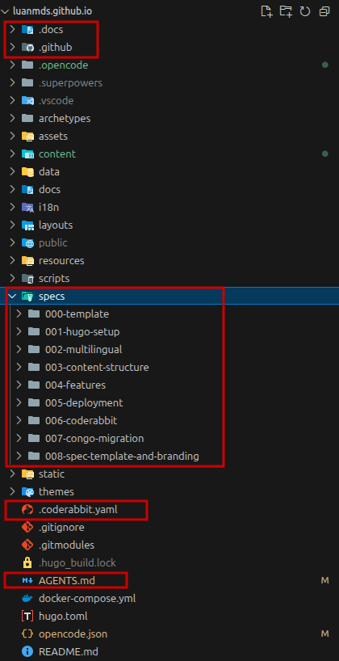

This article consolidates the entire process and knowledge acquired with the project as **AI-Driven**, from the choice of the base *framework* for the blog to the *deploy* on Github Pages.

## Motivation and Context about the experiment

After the last few weeks studying and understanding about **Spec-Driven Development (SDD)** and, especially, **Harness Engineering**. I decide to put it in practice with a tidy project - called too as **brownfield** - that was in drawer: _my own blog_.

Besides, the idea of this experiment was inspired by an _Fábio Akita_ article ([here](https://akitaonrails.com/en/2026/02/20/zero-to-post-production-in-1-week-using-ai-on-real-projects-behind-the-m-akita-chronicles/)), where it shows the process of using AI as an assistant in a real project, containing implementation details. And the blog project was incremented with context docs created from _Eugênio (Gnios) _with tips on how we can document context about the project for AI use ([here](https://gnios.github.io/en/blog/documentacao-antes-das-ferramentas/)).

In summary, this project validates the thesis about how it's using AI as an assistant daily. Next, I bring how it was discuss ideas through *brainstormings*, build specs with a simple SDD custom flow and adjust instructions for agents through the feedback itself using Harness Engineering principles.

**Hands-on:** The source code resulting from this experiment is available in the [luanmds/luanmds.github.io](https://github.com/luanmds/luanmds.github.io) open repository.

## Tooling, Stack & Custom Harness of the Project

Before to deep dive in the methodology and metrics, let's break down the base technologies and the custom harness created to this project.

### Stack used

- `Hugo Framework`: For building the site's body and theme [Congo](https://themes.gohugo.io/themes/congo) with custom colors.
- `Github Pages and Github Actions`: To host and deploy the site. Both are free from Github. 
  - To know more check their [documentation](https://docs.github.com/en/pages).
- `CodeRabbit`: Synthetic AI Agent QA - with free tier! - to **review the code generated in Pull Requests opened by other agents** in the repository. 
  - Configured through the `.coderabbit.yaml` file
- `Playwright`: Tool/Library used to automate functional tests on web pages. In the project, it has the **role of validating front-end changes** before proceeding with commit and merge.
- `OpenCode`: AI Agent via terminal, focused on **coding and tool usage**. Used as the main coding partner. The biggest advantage is the ability to use different LLM models and their skills.
  - It is orchestrated by the project's harness to follow the SDD workflow.
  - Being model-agnostic, it was possible to test with different LLMs, such as *Claude Sonnet*, *Claude Haiku* and *GPT-5.3 Codex*.

### Harness Feedforward

- `AGENTS.md`: Principal file with all project summary and a onboard manual for agents to follow the configured workflow for the project.
- `.docs/`: Folder with detailed context information related to the project. It contains all directives and each file is mapped in the `AGENTS.md`.
- `specs/`: Folder with developed and implemented specifications. Each specification has a `tasks.md` file where everything that needs to be done so that we consider the implementation as Done is listed.

Follow a print about the project harness organization:

## The Spec-Driven Methodology and Agents Orchestration

Something I learned from studying Harness is that understanding the lifecycle better is fundamental for initial alignment and, especially, what can or cannot be done. 

In Spec-Driven Development, the specification is the pillar that guides the entire content creation process. Starting from a *brainstorming*, going through a specification step, decomposition into tasks and finally the implementation. Here I realized that **the specification becomes the main artifact of this process**, different from traditional development where the code is the main artifact.

### The Delivery Lifecycle

The workflow was divided into clear and interdependent stages:

#### 1. Planning

- **Brainstorming:** Using the `brainstorming-skill` (from [Superpowers Skills](https://github.com/obra/superpowers)) to validate architectural decisions and stack before the first commit.
- **Specification (Spec):** Creating Markdown files in the `specs/` folder (operating in *PLAN* mode) detailing the expected behavior and technical constraints.
- **User Validation:** Mandatory step (*Verify and Validate*) where the specification is reviewed, refined and approved by the "Product Owner" (the user itself) before any code is generated.

#### 2. Execution

- **Decomposition into Tasks:** Translation of the approved Spec into a `tasks.md` file with atomic, parallelizable items and a well-defined *Definition of Done* (DoD).
- **Implementation:** Phase where the AI agents take on the execution of the tasks and write the code under the strict supervision of the *Harness*.
- **Playwright Tests:** Visual and functional validation of the delivery using the `playwright-skill` running locally (via Docker) before proceeding to commit.

#### 3. Quality and Deploy

- **Pull Request and CodeRabbit:** Packaging the changes in a PR, triggering the automated code review of CodeRabbit AI.
- **Continuous Deploy:** Automated publication via GitHub Actions sending the validated version to GitHub Pages.


flowchart TD
    %% Phase 1
    subgraph Planning
        direction LR
        B[Brainstorming Skill] --> S[Spec Creation]
        S --> V{User Validation}
        V -- Refine --> S
    end

    %% Phase 2
    subgraph Execution
        direction LR
        T[Task Decomposition] --> I[Implementation]
        I --> P[Playwright Tests]
        P -- Fail --> I
    end

    %% Phase 3
    subgraph QD[Quality & Deploy]
        direction LR
        PR[Create Pull Request] --> CR[CodeRabbit AI Review]
        CR -- Issues Resolved --> D[Deploy to GH Pages]
    end

    Planning -- Approved --> Execution
    Execution -- Pass --> QD


### Use Cases Highlighted

During experiment time, some scenarios are highlighted, in the practice, showing the potential and flexibility of this approach.

#### 1. The Giant Session: Building the Base (PaperMod Theme + Multilingual)

This was the most dense session of the entire project. With **285 minutes** of real active time and 671 messages exchanged, the agent was responsible for generating the complete base of the PaperMod theme on the blog and the entire language switching system. 
The most impressive numbers: **~73.9 million tokens** were consumed in this single session, resulting in a net balance of **+904 lines of code** added. Of this total of tokens, an incredible 97% were read directly from the already established context cache.

#### 2. Spec 007: Migração do tema PaperMod para Congo com Subagents Paralelos

Another notable case was the specification **Spec 007 (PaperMod to Congo theme migration with Parallel Subagents)**. The work lasted **71 minutes**, with a concentrated change of +253 lines and removal of 229 lines, and a total consumption of **~10.6 million tokens**.

Instead of a linear execution, I applied the **Subagent-Driven Development** pattern: the orchestrator agent triggered **8 parallel sub-agents**. Each sub-agent took on an independent task (colors, typography, menu structure), all operating simultaneously on the same source of truth (the Spec). This allowed for a complex migration in record time, with guaranteed architectural consistency.

## Analysis about OpenCode metrics

The data below, were extracted directly from OpenCode database (via `opencode.db`) covering the entire project period. In total, there were **25 sessions** (~12.3 hours of real active time), which modified 96 files and generated a net balance of +1,891 lines of code (+2,765 added, -874 removed).

Follow the details about processing metrics:

| Metric | Quantity | % of total |
|---|---|---|
| **Total Tokens Counted** | **~141.7 million** | **100%** |
| Cache Reads (reused) | ~134.2 million | 94.7% |
| Cache Writes (stored) | ~4.35 million | 3.1% |
| Output (model-generated) | ~548 thousand | 0.4% |
| Reasoning (hidden reasoning) | ~308 thousand | 0.2% |
| Genuinely new input | ~2.26 million | 1.6% |

**The *Cache* Magic and Zero Cost**

The most revealing data of this experiment was the **94.7% of tokens being read from the *cache*** (Context Efficiency). It is interesting to note that the agent keeps the complete context "hot" (files, documentation, history) with each message sent, but does not need to reprocess what is already cached.

This explains how it was possible to consume 141.7 million tokens without additional cost using the GitHub Copilot subscription. The actual inference consumption (new input + reasoning + output) was only ~3.1 million tokens.

**Main Sessions and Productivity**

Follow the table with the distribution of effort and code balance in the main project sessions:

| Section (Focus) | Active Time | Lines Balance | Total Tokens |
|---|---|---|---|
| Project Base (HuGo + PaperMod + Multilingual) | 285 min | +904 / -111 | 73.9M |
| Articles Migration (files `.doc` from Google Drive) | 166 min | +0 / -0 | 23.2M |
| Update About Page | 73 min | +36 / -38 | 8.8M |
| Theme Congo Migration (Spec 007) | 71 min | +253 / -229 | 10.6M |
| Final adjustments + update specs | 39 min | +447 / -214 | 5.9M |
| Responsiveness/favicon/Tags | 33 min | +25 / -16 | 5.7M |
| README.md | 32 min | +144 / -16 | 7.1M |
| Context Collecting | 16 min | +804 / -198 | 3.6M |
| Configure code automation | 14 min | +101 / -2 | 1.5M |

> *Note: The "Articles Migration" session took 166 minutes and processed 23 million tokens without modifying any lines of code in the final repository. This happened because the content and images were processed outside of version control (batch raw content generation).*

**Summary about activities by Session:**

- **Project Base**: Session is more dense than others, the agent set up the complete base of the blog with Hugo, the initial PaperMod theme and the internationalization infrastructure (PT/EN) with translation key.
- **Articles Migration**: Session long focused in process text from draft (via Google Drive/Medium) and format them to markdown with front matter adequate.
- **Update About Page**: Creation and update of specific content for the About page, such as profile picture, history and punctual design adjustments.
- **Theme Congo Migration (Spec 007)**: Execução da Spec 007, orquestrando 8 sub-agentes paralelos para migrar as cores e layout do tema antigo para o Congo, ajustando tipografia e menus simultaneamente.
- **Final adjustments + update specs**: Revision of templates, standardization of the format of the artifacts in the `specs/` folder and refinements before the final deploy.
- **Responsiveness/favicon/Tags**: Fine adjustments of UI/UX, making navigation more responsive, fixing the favicon and adjusting the display of tags in the posts.
- **README.md**: Generation of the repository public file, extracting context directly from the internal documentation after the project was almost finished.
- **Context Collecting**: Session dedicated to generate the base documentation in the `.docs/` folder, mapping stack, architecture and establishing `AGENTS.md` from the current state.
- **Configure code automation**: Initial configuration of linting, CI/CD and integration of CodeRabbit (synthetic QA for Pull Requests).

### LLM Models Utilized in main sessions

| Model | Sessions | Total Processed | Cache Read | Cache Write | Real Processed |
|---|---|---|---|---|---|
| `gpt-5.3-codex` | 5 | ~90,2M | ~87,5M (96%) | — | **~2,7M** |
| `claude-sonnet-4.6` | 20 | ~47,9M | ~43,4M (90%) | ~4,1M | **~387K** |
| `claude-haiku-4.5` | 1 | ~4,9M | ~4,4M (91%) | ~368K | **~36K** |

> *Note: Real processed = new input + output + reasoning — what the model actually inferred.*

## Conclusion

After putting version 1.0 of the project into production ([https://luanmds.github.io](https://luanmds.github.io)), I listed some conclusions and lessons learned along the process:

- **Mindset change as a Developer**: The developer becomes a "Context Designer" and a "Agent Orchestrator". I don't think this is a bad thing, but it requires a new mindset to interact with AIs to extract the maximum benefit. Still, it's necessary to understand what the AI is generating and have solid knowledge about Software Architecture and Design to ensure that the software maintains an acceptable level of quality.

- **Documentation is the key for a good experience**: As a GenAI continues to evolve, the capacity of interaction with it becomes a critical skill. The quality of documentation directly influences the AI's ability to understand the project context and generate relevant and accurate responses.
  - The importance of `AGENTS.md` as a central documentation artifact, that is, a guide that the Agent always carries with it when interacting with it.
  - The SDD, independent of using a framework or a specific tool (as OpenCode), it show the best way to document a project. This is because it's based in the concept of *"documentation of what needs to be done"* instead of *"documentation of what was done"*.

- **The Harness process is the most important in the process of using AI as an assistant**: Without it, the AI has difficulty understanding the project context and generating relevant and precise responses. Therefore, it is important to always review the input used by the AI (Feedforward) and what it returns as a response (Feedback) so that it can refine the project context. 

## That's all folks…

Did you enjoy this report or have any questions about how I applied these concepts in practice? Leave a comment on the repository or reach out to me on social media. Your feedback is always welcome!

---

## References

### SDD, Harness Engineering & Context Engineering

- [Spec-Driven Development: AI Assisted Coding Explained](https://youtu.be/mViFYTwWvcM?si=7xuFcJLoD_18k71L)
- [Understanding Spec-Driven-Development: Kiro, spec-kit, and Tessl — Martin Fowler](https://martinfowler.com/articles/exploring-gen-ai/sdd-3-tools.html)
- [The ONLY guide you'll need for GitHub Spec Kit](https://www.youtube.com/watch?v=a9eR1xsfvHg)

### AI-Assisted Development

- [AI-Assisted Coding Tutorial – OpenClaw, GitHub Copilot, Claude Code, CodeRabbit, Gemini CLI](https://www.youtube.com/watch?v=wlpBCazAY9Q)
- [Do Zero à Pós-Produção em 1 Semana — Fábio Akita (in pt-br)](https://akitaonrails.com/2026/02/20/do-zero-a-pos-producao-em-1-semana-como-usar-ia-em-projetos-de-verdade-bastidores-do-the-m-akita-chronicles/#o-claudemd-a-spec-que-evolui)
- [Antes de qualquer ferramenta: como documentar seu projeto para a IA — Gnios (in pt-br)](https://gnios.github.io/blog/documentacao-antes-das-ferramentas/)
- [How do thinking and reasoning models work?](https://www.youtube.com/watch?v=xCRvOUykOX0)
- [Large Language Models Survey — arxiv.org](https://arxiv.org/pdf/2601.20245)
