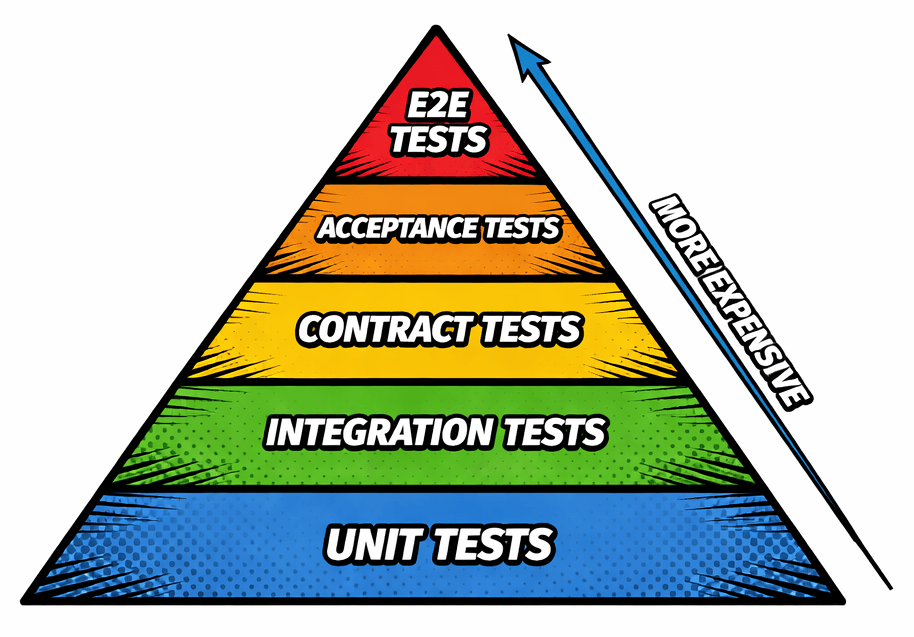
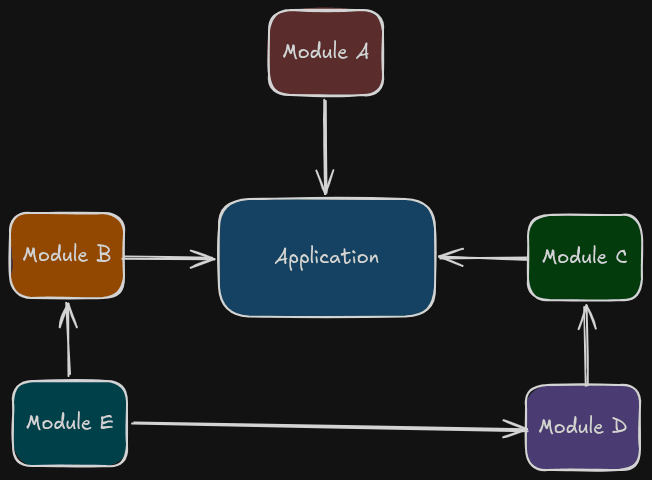
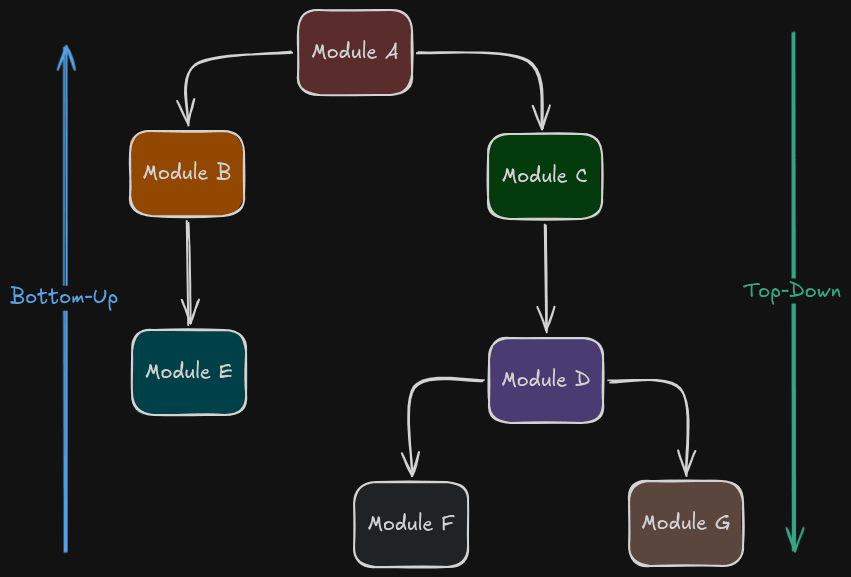

In this article, we will compile the concepts, definitions and general best practices about Integration Tests. In depth, we will explore the scenarios where integration tests fit best, how to implement them to maintain ease, and when not to use mocks in your scenarios. **Understanding this will empower you to make decisions regarding automated testing and to estimate the required effort before writing a single line of code with any programming language or framework**.

**Hands-on:** To consolidate this study, I create a repository [**tests-dotnet-best-practices**](https://github.com/luanmds/tests-dotnet-best-practices). There, you find all these article concepts!

Enjoy the read!

## Test Pyramid and where the integration is in

The famous test pyramid organizes the types of tests a software can perform, always from cheaper (Unit Tests at the base) to more expensive (E2E in the top). The integration tests are in the middle, above the unit tests, typically making up 20% to 30% of your test suite.

Integration tests occupy an intermediate layer, being responsable to verify the connection, interaction and contracts between components, modules, or services. Additionally, they expose system-level problems and ensure high coverage as an important feedback before every deployment.

It is worth noting that **integration tests do not guarantee 100% coverage** and should be used in conjunction with other tests, like unit tests. However, they remove that nagging doubt by answering questions such as: "If I update this module, will it break the dependent modules?" or "How can I ensure this flow keeps working when component X is unavailable?"

## Approaches to test integrations

To choose the right approach, it is important to understand how your application components are coupling and what the complexity level is involved in isolating failures within the flows that connect them.

Tip: Start with critical flows that you must ensure that it works in many situations.

Follow the approach types:

- **Big Bang:** All modules are integrated simultaneously and tested as a whole. Although it seems fast, this approach is a long shot; debugging becomes extremely difficult when an error occurs, since the root cause could be anywhere in the execution chain. 
- **Incremental:** These are approaches to test a module group of an application. Follow them: - **Top-Down:** The test starts from the superior layers (as Controllers or APIs) and moves downward toward the infrastructure layers. Stubs are used to replace the lower-level modules that have not yet been integrated. - **Bottom-Up:** The test starts from low-level modules (as Repositories and database Drivers) and up to business logic layers. It’s excellent to validate the data persistence early in development lifecycle. - **Sandwich (Hybrid):** Joins the advantages about Top-Down and Bottom-Up approaches. It’s test the core of system while peripheral layers are gradually integrated.

### Test Scope

For a more modern perspective, particularly in microservices and distributed systems, it is essential to differentiate the scope of the tests:

- **Narrow Integration Tests**: Focus solely on the communication between a service and one specific external component (e.g., your repository and a SQL Server). The rest of the system is replaced by test doubles. These are faster to run and easier to maintain.
- **Broad Integration Tests**: Validate the integration of all live components that make up a feature, crossing multiple layers and services. They require a more complex environment setup, but guarantee that the complete end-to-end flow works perfectly

## Ideals Scenarios to Use them

Not every feature requires an integration test. The true value of these tests lies in validating flows that cross the boundaries of your application. Indispensable scenarios include:

#### 1. Communication with Persistence and Cache Infrastructure

Scenarios where the application connects with a database (e.g., SQL or NoSQL) and cache systems (e.g., Redis). This ensures that queries, ORM mappings (like Entity Framework), migrations, and integrity constraints (foreign keys, indexes) execute as expected on the real database engine.

### 2. Integration with Messaging Services

Scenarios involving the publish and consume of events in Message Brokers (e.g, RabbitMQ, Azure Service Bus, Kafka). This validates correct object serialization, proper queue/topic configuration, and ensures the application reacts correctly to connection failures or retry policies.

### 3. Consuming External APIs and Web Services

When the system relies of third-party APIs (e.g., payment gateways, geolocation services, etc.). This allows if the external API contract is still respected and how the system handles with many HTTP status codes (like 400, 401, 500) and timeouts. Contract Tests might overlap here.

### 4. Critical Business Flows

Core processes that absolutely can’t fail and cross many services or domains in the same application. For example, a *checkout* process involving components to inventory, payments and logistics. The unit tests typically mock the dependencies in these flows, which can obscure logic bugs that only surface during the real chain of calls.

## Best Practices to follow

To implement integration tests requires more than just writing code; requires an environment strategy and a clear understanding of where system risks lie. Below, are some best practices – which I consider always mandatory – to ensure a best implementation and tests maintenance:

### Identifying components and the SUT

Before you touch the keyboard, the fundamental first step is to map and to diagram all the components of system. Include the **SUT (System Under Test)**. In the integration context, the SUT generally is your API or a specific service that connects with the “external world”. This provides a clear view of your infrastructure boundaries and external dependencies.

**Focus on areas where the code performs I/O operations**, such as databases, third-party APIs, microservices, and message queues. Pay special attention to highly coupled components, as they are undoubtedly the most fragile! If your architecture uses Adapters or Repository patterns, these are your primary targets to verify accurate data translation between your domain and external systems.

BDD (Behaviour-Driven Design) and Event Storming can make this mapping process easier. To measure coupling, you can use Afferent and Efferent Coupling metrics

Techniques like [*BDD (Behaviour-Driven Design)*](https://behave.readthedocs.io/en/latest/philosophy/) and [*Event Storming*](https://www.eventstorming.com/), can make this mapping process easier. To measure coupling, you can use [Afferent and Efferent Coupling](https://coupling.dev/posts/related-topics/afferent-and-efferent-coupling/) metrics.

### Creating a Production-like environment 

The usefulness of an integration test is directly tied to your fidelity. The best modern practice is utilizing **containerization** (via Docker) to simulate real infrastructure. This enables you to run tests against database engines and message brokers that are identical to those in production, drastically increasing your chances of catching real configuration or behavioral errors.

Furthermore, integrate this environment into your CI pipeline. While not every single commit requires a full suite run, having this automated safety net prevents regressions from reaching the final environment.

### Test Doubles, why don’t we use them in critical flows

The Test Doubles are powerful tools for isolation and performance. They are perfect for scenarios involving slow, inaccessible dependencies or when simulating hard-to-reproduce failures like network timeouts.

- **Mocks:** To validate specific behaviours and interactions.
- **Stubs:** To give simple, canned responses.
- **Fakes:** To functional implementations, but simplify (like SQLite in memory).

However, be careful: **avoid using doubles in critical flows**. A “fake” database might have different complex transactions or case-sensitivity rules than your real database, which can mask fatal bugs. For your core business logic, high-fidelity validation against resources is non-negotiable for a safe deployment.

### Contract Tests through integration

In distributed ecosystems and microservices, ensuring that data consumers and providers speak the exact same language is vital. **Contract Testing** solves the issue of integration tests becoming too slow or flaky due to reliance on multiple live services.

This type of test focuses purely on message structures and communication protocols, making it lighter and faster since it doesn't require the entire ecosystem to be up and running. **It can be executed as a dedicated subset of your integration strategy** using tools like [**Pact**](https://devblogs.microsoft.com/ise/pact-contract-testing-because-not-everything-needs-full-integration-tests/) to efficiently validate API and messaging compatibility

## This is all Folks…

If you've made it this far, you've realized that writing integration tests isn't just about increasing code coverage percentage. By understanding your application's boundaries, choosing the right approach for each scope, and applying modern tools to simulate the real world (like real containers instead of just mocks), you drastically elevate your system's resilience.

Theory is the map, but practice is the journey. Be sure to check out the [**tests-dotnet-best-practices**](https://github.com/luanmds/tests-dotnet-best-practices) repository to see how to apply these concepts in real code using .NET 9, Testcontainers, and Aspire.

If you found this content helpful, send me your feedback and share it with your team. What are the biggest challenges you face when creating integration tests in your projects? Let me know in the comments, let’s exchange experiences!

## References

- [https://martinfowler.com/bliki/IntegrationTest.html](https://martinfowler.com/bliki/IntegrationTest.html)
- [Integration Testing - Engineering Fundamentals Playbook](https://microsoft.github.io/code-with-engineering-playbook/automated-testing/integration-testing/)
- [Integration Testing - Software Engineering - GeeksforGeeks](https://www.geeksforgeeks.org/software-testing/software-engineering-integration-testing/)
- [ASP.NET Core Integration Testing Tutorial](https://www.youtube.com/watch?v=RXSPCIrrjHc&pp=ygUSaW50ZWdyYXRpb24gdGVzdHMg)
- [https://learn.microsoft.com/en-us/aspnet/core/test/integration-tests](https://learn.microsoft.com/en-us/aspnet/core/test/integration-tests?view=aspnetcore-9.0&pivots=nunit)
- [Choosing a testing strategy - EF Core \| Microsoft Learn](https://learn.microsoft.com/en-us/ef/core/testing/choosing-a-testing-strategy)
- [https://coupling.dev/posts/related-topics/afferent-and-efferent-coupling/](https://coupling.dev/posts/related-topics/afferent-and-efferent-coupling/)
- [https://behave.readthedocs.io/en/latest/philosophy/](https://behave.readthedocs.io/en/latest/philosophy/)
