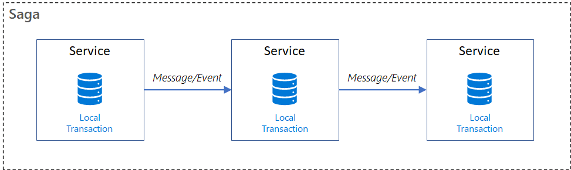
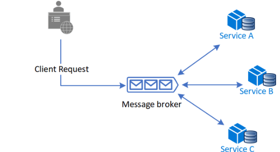
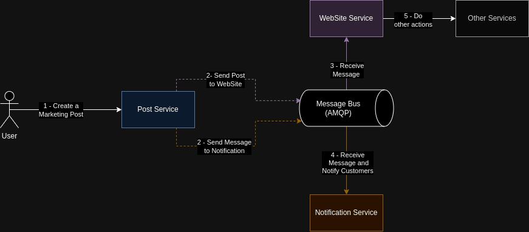
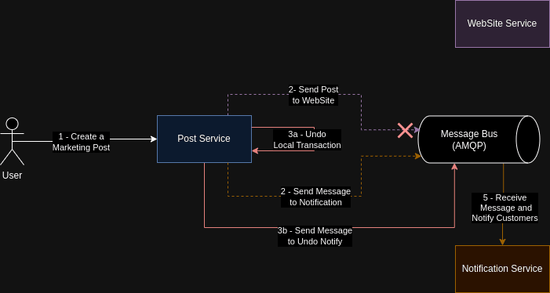
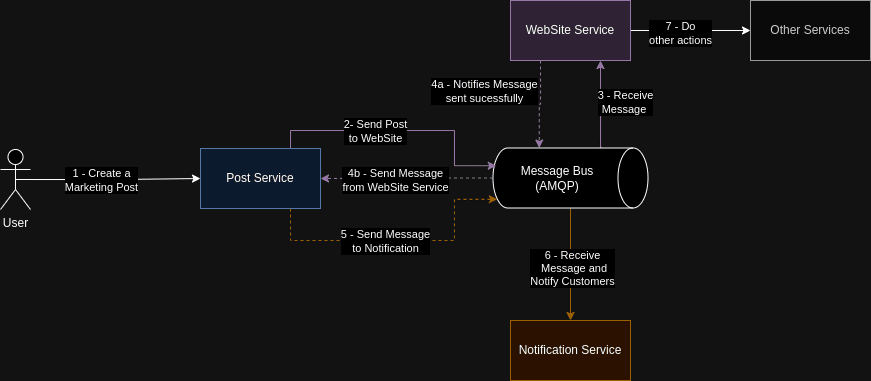

In this article, I will use the Saga Pattern to demonstrate how to deal with transactions in scenarios and do rollbacks about these transactions in microservices like compiled way with plus a sample approaching principal topics.

The point here is to use this article for a consult in the future, I await your feedback. Enjoy your reading!

## Saga’s Idea

The big idea to use Sagas started from a specific problem in systems using longer or sequential transactions (known as [Long-Lived Transactions](https://en.wikipedia.org/wiki/Long-lived_transaction) or LLT ) with database atomic operations and interactions with other systems. The standard shape of LLT is to distribute transactions, in other words, to make operations in many services or databases that manipulate related data.

This pattern matured with time and acquired new characteristics that assist distributed systems’ modern architectures, databases like NoSQL and message brokers that deal with data consistency and find the balance using the CAP Theorem.

Before demonstrating this pattern, go to understand the distributed transactions problem!

## Distributed Transactions and ACID Issues

Nowadays, we find microservice architectures in modern systems using distributed transactions and the [ACID model](https://www.lifewire.com/the-acid-model-1019731). There are limitations in this approach that can create problems when synchronising data and undo operations for unavailability or cancellation of a process.

The first problem shows itself precisely in dependency on a microservice when it makes an operation that depends on another operation from another microservice that sends a request for the first microservice. The second problem appears in a principal characteristic of microservices: unique architecture, when they are formed using patterns as [database-per-microservice](https://microservices.io/patterns/data/database-per-service.html) model, where there is the liberty of selecting any database type and how data persist, besides communicating in your own way (e.g. by messaging or HTTP protocol). This complicates, even more, the ACID model implementation because of the extensive management for each made transaction and, if a transaction fails, notifies others transactions about the problem and they take action.

There are ways to keep data consistent with distributed transactions beyond Saga Pattern - I show you soon, I promise - like the protocols *inter-process*, *two-phase commit*, *Try-Confirm-Cancel (TCC)* and others. This article focuses on Saga since the biggest used and appropriate in most modern solutions and software architectures.

## The Saga Pattern

A saga is a flow represented by a transaction sequence following a specific synchronous and/or asynchronous order. These transactions aren’t distributed and each transaction is local. After a transaction is confirmed to finish, it calls the next transaction so on until the end of Saga. Be possible to have a saga identifier for each transaction in the chain and get a complete tracker flow.

### Orchestration and Choreography

Saga can be implemented using two actual models:

With an **Orchestrator**, known as **Saga Execution Coordinator (SEC)**, controls each saga transaction and is oriented to the next transaction or undo commits from old transactions when some fail (I talk about this as follows). As a maestro and your orchestra, know always the next step and who has to do it.

In this simple sample, a Broker consolidates, manages and provides all the communication between the three services. Orchestration includes a strong dependency on the centraliser as a bad side. In this case, if the broker is offline, all services are offline too.

Or the Choreography model, like a Flash Mob (I am old!), each participant - or a microservice, in our case - knows how and when to make your step wait or not for the step of other participants. Backing to our reality, microservices know the saga, your steps and when to start your local transaction.

The example below shows a flow binding four systems (A, B, C and D) and three steps to do. In each step, the systems act on a received action, in this case, we use a messaging broker and HTTP protocol. The biggest drawback is the administration and monitoring of each system to guarantee end-to-end operations.

### Challenges to implement

Independent of the implemented approach and any other pattern or technology, there will be barriers to be considered in [Trade-Off](https://pt.wikipedia.org/wiki/Trade-off) balance.

Follow a list with some possible problems:

- Observability implementation better-detailed way for each step in the flow of Saga;
- Will have fail points. And to understand how to revert they each application is essential (I detail with an example to the next topic);
- Debugging and tracking an entity or aggregate can be difficult because exists many of those. So including a Saga Identifier and coordination between the apps is extremely necessary;
- High probability of using Events (see Event-Driven Architecture) in Saga flow. Improving complexity even more and obligate to improve anything sent and received control in queues and topics.

## Exemplify with Use Case

To exemplify how to use Saga, we’ve a dummy use case compound with three microservices in a Marketing Area. Below is a resume of how each service operates:

- First is the create posts service via API used by a Marketing employee, the **Post Service**.
- The second is sending e-mails to external customer service when there is a new post and using a messaging bus to communicate, the **Notification Service**.

<!-- -->

- Last is an external service that receives a post from the messaging bus and persists it in a database to an external WebSite, the **Website Service**.

The Saga begin with the creation of a marketing post (with discounts, coupons, promotions…) that must notify the customers and update the website.

Next, go with to success Saga flow complete:

So beautiful! But, what if when to create a new post and notification to customers by e-mail was concluded at the same time the post wasn’t updated on the website? We have a critical failure and must handle it. Next, I show how to deal with this problem.

## Handling Failures in a Saga 

### Retry Pattern

When there is a failure, we can keep retaining a step of Saga for a certain amount of times combined with an interval time until we are sure the failure occurred together with it will not resolved automatically. This retry approach to any action is called Retry Pattern.

Lookback the before flow let’s imagine a situation where the messaging was offline by some seconds and the message to the Website service wasn’t sent (step 3). Assuming that the Post Service has a policy of retaining messages trying a certain amount of times each x minutes, we have the flow:

Is great, right? the service performed many retentions until messaging was online again. Also, we don’t need an alert screaming around. But…when we are sure of failure, even after applying all policies of retry? Need to take other actions to resolve or undo this in our Saga. The answer can be the Compensating Transactions.

### Compensating Transactions

Okay, there was a failure in our flow preventing to continues Saga. We should compensate for this error and undo previous actions.

To compensate, Saga’s pattern has the compensating transactions as an indicator mechanism for a transaction done to be…undone and can warn other applications to undo your local transactions too.

Therefore, we continue with critical failure cases where customers receive notifications with new promotions or discounts but there are not any promotions on the website! The next steps are to undo and send an errata they like as compensation. So, changing point of fail in flow and has a new resolution:

Steps 3a and 3b are compensating transactions that activate as soon as step 2 fails.

### Reducing Rollbacks

Also is possible to prevent failures and compensations by just analysing points of failure and reorganizing the process. Too is possible to review functional and non-functional requirements.

Reviewing all flow, prevent the previous failure just by adjusting the send of Post to be updated on the website first before sending notifications to customers. In other words, send a message to the Website service (step 3) after getting a response from the message that was received successfully (steps 4a and 4b) and then send a message to notify customers (step 5). Such avoids the inconvenience mentioned likewise system will be resilient and trackable of failures.

Finally, here is the refactored flow:

### It’s all folks…

In this article, we saw not easily found details of the Saga Pattern plus problems that appear when implementing it. The pattern is commonly used together with many patterns like [CQRS](https://martinfowler.com/bliki/CQRS.html) and [Event-Driven](https://learn.microsoft.com/en-us/azure/architecture/guide/architecture-styles/event-driven), upgrading system architecture and fortifying your structure in various applications and products.

I hope you’ve increased your knowledge and range of techniques to apply engineering or architecture software! See you Later o/

## References

- Sample of Saga using Kafka and .Net: https://github.com/luanmds/kafka-dotnet-study/tree/main/sample-02
- [https://learn.microsoft.com/en-us/azure/architecture/reference-architectures/saga/saga](https://learn.microsoft.com/en-us/azure/architecture/reference-architectures/saga/saga)
- [https://medium.com/codex/compensating-transaction-in-microservices-15b1f88a7c29](https://medium.com/codex/compensating-transaction-in-microservices-15b1f88a7c29)
- [https://livebook.manning.com/book/microservices-patterns/chapter-4/](https://livebook.manning.com/book/microservices-patterns/chapter-4/)
- [https://blog.sofwancoder.com/try-confirm-cancel-tcc-protocol](https://blog.sofwancoder.com/try-confirm-cancel-tcc-protocol)
- [https://en.wikipedia.org/wiki/Inter-process_communication](https://en.wikipedia.org/wiki/Inter-process_communication)
- [https://en.wikipedia.org/wiki/Two-phase_commit_protocol](https://en.wikipedia.org/wiki/Two-phase_commit_protocol)
- https://www.cs.cornell.edu/andru/cs711/2002fa/reading/sagas.pdf
- [https://en.wikipedia.org/wiki/Long-lived_transaction](https://en.wikipedia.org/wiki/Long-lived_transaction)
- https://www.lifewire.com/the-acid-model-1019731
