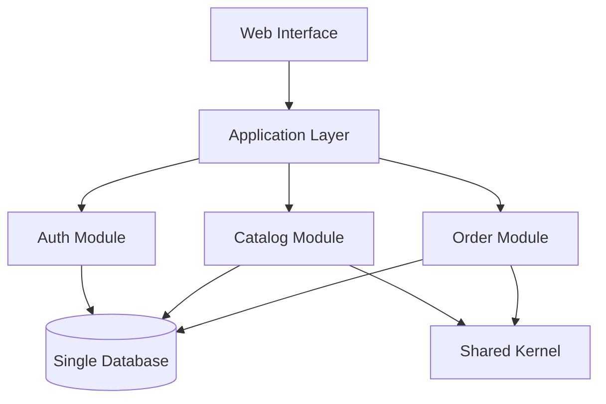
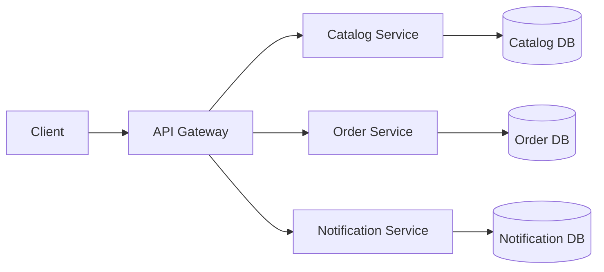
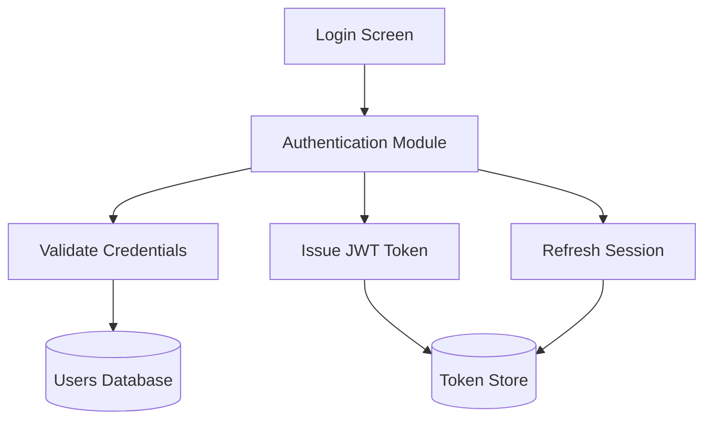
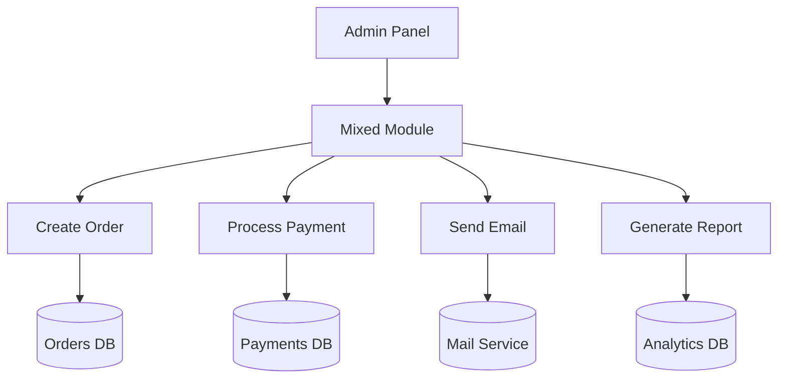
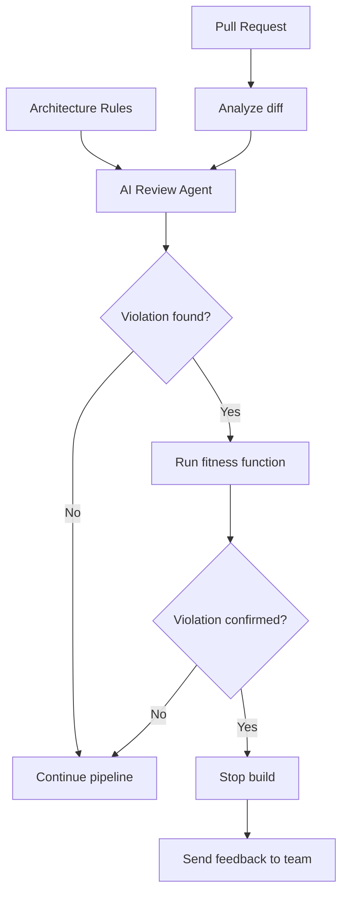

Com o advento da inteligência artificial (famosa IA), você já deve ter percebido - e visto em diversos lugares - que a IA virou commodity com a capacidade de gerar código rápido e em grande escala. Mas isso não garante qualidade e segurança para o software que está sendo construído e gera dificuldades na manutenção e sustentação do sistema a longo prazo.

Neste artigo, vamos relembrar alguns fundamentos da engenharia de software essenciais que sempre serviram como guardrails do design e arquitetura do nosso software, mas o uso deles hoje é muito mais que obrigatório quando incluímos IA no ciclo de desenvolvimento. Além disso, vamos entender como a IA vira uma parceira na manutenção desses guardrails no dia a dia do desenvolvimento.


## Revisando Modularidade, Coesão e Acoplamento

A seguir, vamos revisar os conceitos de modularidade, coesão e acoplamento, entendendo como eles se relacionam e como impactam a qualidade do software a longo prazo. Isso nos permite tomar decisões embasadas em *trade-offs* técnicos e de negócio.

### Modularidade e Granularidade para organizar responsabilidades

De forma resumida, **modularidade** é um termo geral usado para indicar qualquer agrupamento de código: classes (na orientação a objetos), funções (em paradigmas funcionais), bibliotecas, serviços, etc. O seu foco principal é dividir o sistema em partes (agrupamentos) que facilitem a compreensão, sendo independentes e coesas (vamos ver sobre coesão a seguir). Cada parte é chamada geralmente de **módulo**.

Sua maior vantagem está justamente nessa divisão em módulos, pois facilita a manutenção e evolução do software, possibilitando identificar qual código, ou em quais módulos, deve ser alterado para atender a uma nova necessidade ou correção de bug.

#### Granularidade de Módulos

Enquanto a modularidade foca em agrupar código de acordo com as responsabilidades, **a granularidade foca no tamanho do módulo**, ou seja, um módulo pode conter uma ou mais responsabilidades.

E a definição do quão granular um módulo deve ser parte do estilo de arquitetura escolhido: uma arquitetura monolítica pode ter módulos de acordo com regras de negócio (exemplo 1 abaixo) ou separados por partes técnicas, como na arquitetura em camadas. Já uma arquitetura de microsserviços tende a ter módulos menores, com responsabilidades mais específicas e focadas em domínios de negócio (exemplo 2 abaixo).

> **Dica**: Trate a granularidade como um *trade-off* que acompanha a arquitetura escolhida para o sistema, mas que deve ser reavaliado constantemente para cada módulo. A evolução do sistema pode alterar a responsabilidade de um módulo e fazer com que dividi-lo em um novo serviço comece a fazer sentido.

Seguem alguns exemplos de modularidade:

*Exemplo 1: Monólito modular com fronteiras bem definidas.*



*Exemplo 2: Módulos em uma arquitetura de microsserviços.*




### Coesão para criar sentido entre as partes

Agindo como uma métrica de qualidade, a coesão indica o quão bem as partes de um módulo estão relacionadas entre si, cumprindo a responsabilidade que lhe foi atribuída. Enquanto a modularidade agrupa, a coesão garante que o agrupamento faça sentido. Isso significa que as partes cumprem a responsabilidade atribuída ao módulo.

Num cenário ideal, um módulo considerado "coeso" contém tudo que é essencial para seu funcionamento, sem depender de outros módulos para cumprir sua responsabilidade. Tentar adicionar mais ações ou dividi-lo pode resultar em aumento de acoplamento (veremos a seguir) e perda de legibilidade.

No fim, a coesão também é uma pergunta: *"O que esse módulo faz ou está fazendo? Ele cumpre a responsabilidade que lhe foi atribuída?"*

#### E como define a responsabilidade?

A responsabilidade se define pela função que o módulo deve cumprir dentro do sistema. Seja por um domínio ou subdomínio definido usando Domain-Driven Design (DDD), seja por uma regra de negócio ou por uma funcionalidade técnica compartilhada (como um serviço de autenticação, por exemplo).

> **Dica**: tenha o hábito de nomear os módulos de acordo com a responsabilidade que eles cumprem, isso ajuda a manter a coesão e facilita a compreensão do sistema. Sempre revise o que o módulo faz e se o que há nele ainda cumpre a responsabilidade atribuída a ele. Se não, é hora de refatorar.


#### Tipos de coesão

Há diversos tipos de coesão, mas os mais comuns, e nos quais devemos focar, são:
- **Coesão Funcional (A melhor)**: Todas as partes do módulo trabalham juntas para realizar uma única função bem definida. É o caso ideal de módulo. **Exemplo**: Um módulo de autenticação que lida com login, logout e verificação de tokens.
- **Coesão Coincidental (A pior)**: As partes do módulo estão agrupadas, mas não têm uma relação clara entre si. **Exemplo**: Um módulo que contém funções de autenticação, manipulação de arquivos e envio de e-mails.
- Outros tipos de coesão incluem **Coesão Lógica**, **Coesão Temporal**, **Coesão Procedural**, entre outros, cada um com suas características e impactos na qualidade do software. *Recomendo a leitura do artigo [Cohesion and Coupling](https://www.geeksforgeeks.org/software-engineering/software-engineering-coupling-and-cohesion/) para uma visão mais detalhada.*

**Alguns casos de uso de coesão**

*Exemplo 1: Alta coesão em um módulo de autenticação.*



*Exemplo 2: Baixa coesão misturando responsabilidades diferentes.*




### Acoplamento para reduzir dependências indesejadas

O acoplamento tem um olhar mais amplo nesse meio e entra como uma forma de quantificar as conexões de dependência entre módulos, classes, funções e componentes menores do sistema.

Podemos entender o conceito de "acoplado" **quando uma alteração no código afeta obrigatoriamente ao menos dois componentes**, exigindo uma correção ou ajuste no comportamento.

**Ter um alto acoplamento entre módulos entende-se como um problema**, pois dificulta a manutenção, testabilidade - exigindo retestar e revalidar uma parte no sistema que não deveria ser afetada - e também afeta a própria modularidade pois acaba reduzindo-a e passando a ilusão de ter menos módulos por conta de dependência entre eles.

#### Metrificação do acoplamento

Para encontrar um nível aceitável de acoplamento podemos utilizar técnicas para levantar métricas úteis e ajude a quantificar isso, como por exemplo:

**Acoplamento Aferente (Ca) e Eferente (Ce)**:

São métricas que ajudam a medir o acoplamento de um módulo com outros módulos do sistema e foi popularizado pelo mestre Uncle Bob.

- Aferente (Ca): Mede o número de componentes externos que dependem do seu componente (conexões de entrada). Representa a responsabilidade do módulo.
- Eferente (Ce): Mede o número de dependências de saída do seu componente para outros módulos externos. Representa a instabilidade do módulo

Neste exemplo, o `Módulo Billing` tem **acoplamento aferente** porque `Checkout` e `Orders` dependem dele, enquanto tem **acoplamento eferente** porque depende de `Payment Gateway` e `Shipping Service`.


**Conascência**

É um modelo de classificação de formas de acoplamento introduzido por Meilir Page-Jones (veja mais nas referências) para estender a análise de acoplamento e interdependências a um design orientado a objetos. A conascência pode ser estática, quando a dependência é identificada no código, ou dinâmica, quando depende do comportamento em tempo de execução.

Na prática, podemos usar a conascência para identificar como dois componentes dependem um do outro e buscar formas mais fracas de dependência. Por exemplo, compartilhar o nome de um parâmetro entre módulos é mais seguro do que depender da posição dos parâmetros, pois uma alteração na ordem pode quebrar o consumidor.

```mermaid
flowchart LR
    Client[Order Service] -->|amount, currency| Billing[Billing Module]
    Billing --> Contract[Payment Contract]
    Legacy[Legacy Client] -->|values[0], values[1]| Position[Positional Contract]
    Position -.-> Billing
```


> **Dica**: Há outras formas de medição além de diversos outros tipos de acoplamento, mas o importante é entender que **quanto mais fraco o acoplamento, melhor**. E que a coesão e o acoplamento andam juntos, pois um módulo coeso tende a ter menos dependências externas e, portanto, menor acoplamento.

## Manter a integridade dos conceitos com Guardrails automatizados

Até aqui, vimos como a modularidade, coesão e acoplamento auxiliam na tomada de decisões. Agora, vamos entender como podemos usar esses conceitos como *guardrails* do software e como a IA pode nos ajudar a automatizar os *checks* de qualidade do software.

Após a implementação de um módulo - ou uma versão inicial do sistema - **precisamos garantir que a modularidade, coesão e acoplamento estão sendo respeitadas a cada *Pull Request* aberto**. O Sonar ou alguma outra ferramenta de análise de código ajuda bastante a garantir a qualidade do código evitando CVEs, bugs, vulnerabilidades e problemas de performance, mas não garante que a arquitetura e design do software estão sendo respeitados conforme o projeto, pois isso é muito particular do contexto que envolve a criação daquele sistema. 

Por isso, precisamos de mecanismos automatizados contendo as regras da arquitetura e do design desse software específico. A seguir, explico o que são as funções de aptidão (*fitness functions*) e como podemos usá-las como regras gerais que respeitem a arquitetura e o design do software.


## Fitness Functions para manter os princípios da arquitetura e design do software

De forma geral, **fitness functions** são definidas como **qualquer mecanismo que fornece uma avaliação de integridade objetiva de alguma característica ou conjunto de características arquiteturais**. O termo é emprestado da computação evolutiva, onde um algoritmo genético usa uma função de aptidão para medir quão perto um resultado está de atingir seu objetivo.

Na prática, elas servem como **guardrails automatizados** na sua esteira de integração contínua (CI/CD). Se um desenvolvedor (ou uma IA geradora de código) realizar uma alteração que viole uma decisão arquitetural, como introduzir uma dependência proibida ou degradar a performance, a fitness function falhará o build imediatamente, oferecendo feedback rápido e evitando a deterioração estrutural.

> **Dica**: Essas funções podem ser implementadas em qualquer linguagem de programação e em qualquer etapa da esteira CI/CD. Podemos usar ferramentas prontas como *ArchUnit (Java)*, *NetArchTest (C#)* ou até mesmo scripts customizados em *Python*, *Bash*, etc.

As medições dessas funções são divididas em três categorias principais:

1. **Métricas Estruturais**: Focam na qualidade interna e design do código (ex: coesão, acoplamento e modularidade).
2. **Métricas Operacionais**: Medem o sistema em execução (ex: resiliência, latência, throughput).
3. **Métricas de Processo**: Avaliam o fluxo do desenvolvimento (ex: cobertura de testes, conformidade de deploys).


### Exemplos Práticos de Fitness Functions

Seguem alguns exemplos comuns em pseudocódigo para cada tipo de métrica mencionada.

#### 1. Integridade entre Camadas de código (Métrica Estrutural)

Este teste garante que a estrutura em camadas clássica (Apresentação -> Negócio -> Persistência) seja respeitada, impedindo acessos diretos proibidos (como a camada de interface chamar o banco diretamente).

```pseudocode
Procedimento ValidarAcoplamentoDeCamadas()
    // 1. Mapeia os pacotes/namespaces do projeto
    ClassesApresentacao = BuscarClassesNoPacote("com.sistema.apresentacao.*")
    ClassesNegocio      = BuscarClassesNoPacote("com.sistema.negocio.*")
    ClassesPersistencia = BuscarClassesNoPacote("com.sistema.persistencia.*")

    // 2. Regra: Apresentação só pode chamar Negócio
    Para Cada classe Em ClassesApresentacao Faça
        Se classe.DependeDeAlguma(ClassesPersistencia) Então
            FalharTeste("Violação Arquitetural: Apresentação não pode acessar a Persistência diretamente!")
        FimSe
    FimPara

    // 3. Regra: Persistência não pode chamar ninguém acima dela
    Para Cada classe Em ClassesPersistencia Faça
        Se classe.DependeDeAlguma(ClassesNegocio) Ou classe.DependeDeAlguma(ClassesApresentacao) Então
            FalharTeste("Violação Arquitetural: Persistência não pode depender das camadas superiores!")
        FimSe
    FimPara

    Retornar SUCESSO
FimProcedimento
```

#### 2. Resiliência e Desempenho do software (Métrica Operacional)

Abaixo, a função simula uma janela de *stress test* para garantir que o sistema mantenha a estabilidade mesmo sob condições de rede degradadas.

```pseudocode
Procedimento ValidarResilienciaSobLatencia()
    // Instancia o executor de testes de carga simulada
    AmbienteCarga = IniciarAmbienteDeCarga(UsuariosSimultaneos = 1000)
    
    // Injeta latência artificial de rede (ex.: 300 ms)
    AmbienteCarga.InjetarLatenciaRede(Milissegundos = 300)
    
    Resultados = AmbienteCarga.ExecutarTransacoes(Quantidade = 10000)
    
    // Asserções objetivas baseadas em métricas
    TaxaDeErro = Resultados.ObterMapeamentoDeErros() / 10000
    TempoMaximo = Resultados.ObterTempoDeRespostaPercentil99()
    
    Assegurar(TaxaDeErro < 0.05, "Falha: Taxa de erro sob latência excedeu o limite de 5%. Atual: " + TaxaDeErro)
    Assegurar(TempoMaximo < 10.0, "Falha: Tempo de resposta (P99) excedeu 10 segundos sob latência. Atual: " + TempoMaximo)
    
    Retornar SUCESSO
FimProcedimento
```

#### 3. Operabilidade (Padrões Mínimos de Produção)

Em algumas arquiteturas, nenhum microsserviço ou código é promovido se não for "operável" pelos times de DevOps/SRE. Este teste de processo assegura a presença de artefatos de manutenção obrigatórios.

```pseudocode
Procedimento ValidarProntidaoParaProducao()
    EstruturaProjeto = CarregarDiretorioDoProjeto()
    
    // Garante documentação viva mínima
    Assegurar(EstruturaProjeto.ExisteArquivo("README.md"), "Operabilidade: Falta arquivo README.md para o serviço.")
    Assegurar(EstruturaProjeto.ExisteArquivo("runbook.md"), "Operabilidade: Falta arquivo runbook.md contendo guias de mitigação de incidentes.")
    
    // Garante que o microsserviço expõe um endpoint de *health check* ativo para o Kubernetes/orquestrador
    HealthController = EstruturaProjeto.BuscarClasse("HealthCheckController")
    Assegurar(HealthController != Nulo, "Operabilidade: O serviço precisa expor um endpoint '/health' ativo.")
    
    Retornar SUCESSO
FimProcedimento
```

#### 4. Revisão de código com Agentes de IA

Um uso prático da IA é incluí-la como uma etapa de revisão do *Pull Request*. 

Imagine que uma alteração no módulo de pedidos passe a importar diretamente o módulo de pagamentos, desrespeitando a regra de que essa comunicação deve ocorrer por meio do módulo de cobrança. O agente pode analisar o *diff*, consultar as regras arquiteturais do projeto, explicar a violação e sugerir uma alternativa mais adequada.

Nesse fluxo, a IA atua como uma revisora capaz de interpretar a alteração e oferecer contexto para o time. O resultado pode ser combinado com uma *fitness function* determinística: se a regra for violada, a *pipeline* interrompe o *build* e devolve o motivo para que a alteração seja corrigida.



### As fitness function não substituem as ferramentas de análise de código

Ferramentas atuais como o Qodana, SonarQube, ESLint, e outras ajudam a manter a qualidade do código, mas não substituem as fitness functions que verificam a conformidade arquitetural de forma automatizada.

Por isso, é importante entender que **as fitness functions são complementares às ferramentas de análise de código**, e não substitutas. Elas atuam como uma camada adicional de proteção, garantindo que as decisões arquiteturais sejam respeitadas e que o software evolua de maneira sustentável.

Com tanto código atual sendo gerado por agentes de IA, **é essencial que essas funções sejam implementadas e mantidas para evitar a degradação da arquitetura do sistema ao longo do tempo.**

## Concluindo

Revisar os fundamentos me fez perceber que o peso deles aumentou drasticamente. Pois o código atual é barato e gerado rapidamente, com isso, o desenvolvedor/arquiteto deve focar ainda mais no que está entorno do sistema, para que a arquitetura e o design não se deteriorem com o tempo. E isso é um trabalho contínuo, que exige disciplina e atenção aos detalhes!

Modularidade, coesão e acoplamento não devem ser tratados apenas como conceitos teóricos. Eles podem orientar decisões de design e também ser transformados em fitness functions capazes de verificar continuamente a integridade da arquitetura. Quando combinamos isso com o *Harness Engineering* e com o uso responsável da IA, conseguimos aumentar a velocidade de desenvolvimento sem abrir mão da qualidade.

No fim, a IA pode gerar muito código, mas ainda somos nós que precisamos definir as regras do jogo. Como esses guardrails têm sido aplicados no seu time? Compartilhe sua experiência nos comentários.


## Referências e Leituras Recomendadas

- [Fundamentals of Software Architecture: A Modern Engineering Approach](https://a.co/d/0gGgdFIW)
- [Cohesion and Coupling](https://www.geeksforgeeks.org/software-engineering/software-engineering-coupling-and-cohesion/)
- [Lesson 196 - Modularity and Architectural Styles](https://www.youtube.com/watch?v=Cmsyn7HK6YE)
- [Coupling.dev Modularity](https://coupling.dev/posts/core-concepts/modularity/)
- [Coupling.dev Afferent and Efferent Coupling](https://coupling.dev/posts/related-topics/afferent-and-efferent-coupling/)
- [Coupling.dev Connascence](https://coupling.dev/posts/related-topics/connascence/)
- [Monolithic vs Distributed Systems](http://geeksforgeeks.org/system-design/analysis-of-monolithic-and-distributed-systems-learn-system-design/)
- [Fitness Function Driven Development](https://www.thoughtworks.com/en-br/insights/articles/fitness-function-driven-development)
- [Fitness Functions in Architecture](https://www.infoq.com/articles/fitness-functions-architecture/)
- [Best Static Code Analysis Tools](https://blog.jetbrains.com/qodana/2026/04/best-static-code-analysis-tools/)
