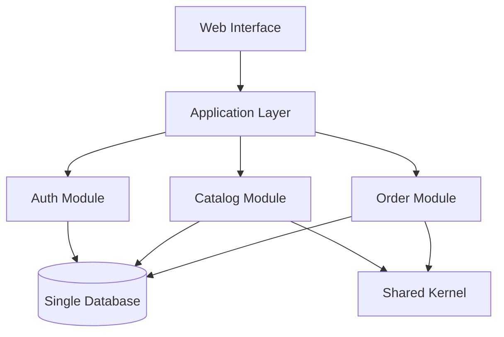
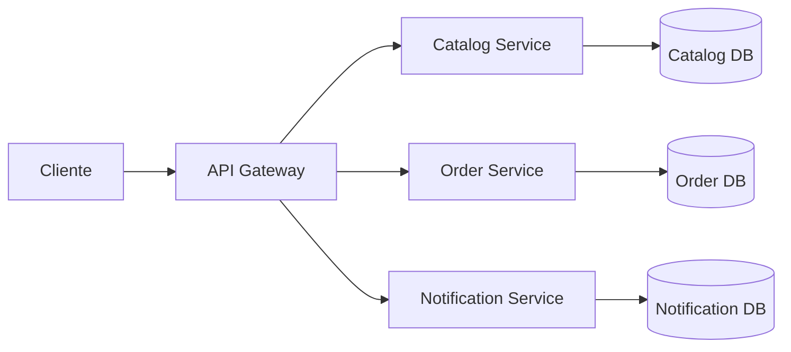
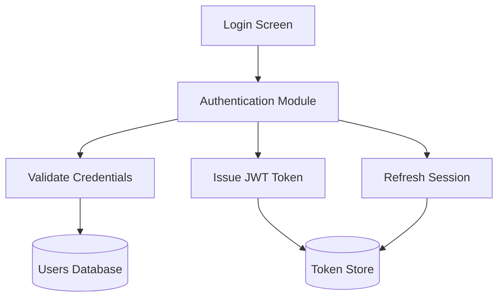
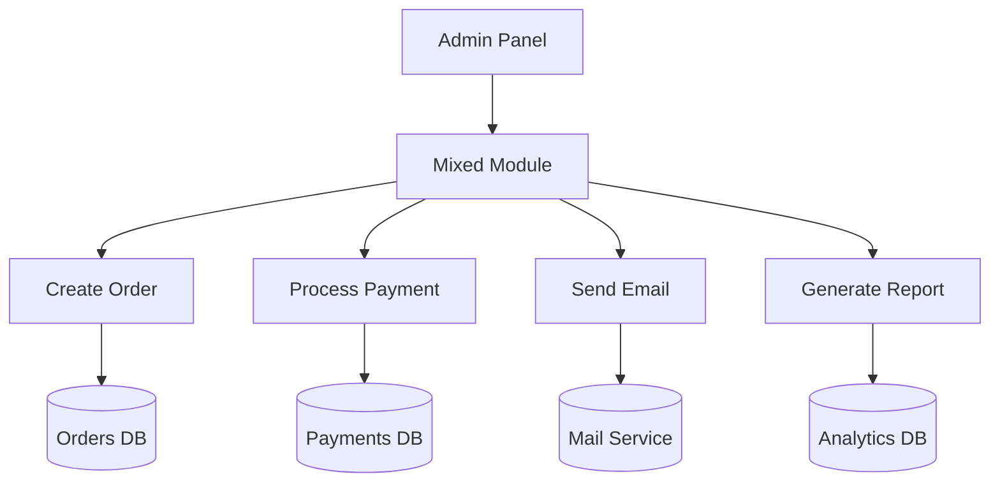

Com o advento da inteligência artificial (famosa IA), você já deve ter percebido - e visto em diversos lugares - que a IA virou commodity com a capacidade de gerar código rápido e em grande escala. Mas isso não garante qualidade e segurança para o software que está sendo construído e gera dificuldades na manutenção e sustenção do sistema a longo prazo.

Neste artigo, vamos relembrar alguns fundamentos da engenharia de software essenciais que sempre serviram como guardrails do design e arquitetura do nosso software, mas o uso deles hoje é muito mais que obrigatório quando incluímos IA no ciclo de desenvolvimento. Além disso, vamos entender como a IA vira uma parceira na manutenção desses guardrails no dia a dia do desenvolvimento.

## Revisando Modularidade, Coesão e Acoplamento

A seguir vamos revisar os conceitos de modularidade, coesão e acoplamento. Entendendo como eles se relacionam e como impactam a qualidade do software a longo prazo e nos permite tomar decisões embasadas em trade-offs técnicos e de negócio.

### Modularidade e Granularidade para organizar responsabilidades

De forma resumida, **modularidade** é um termo geral usado para indicar qualquer agrupamento de código: classes (na Orientação a objetos), funções (em paradigmas funcionais), bibliotecas, serviços, etc. O seu foco principal é dividir o sistema em partes (agrupamentos) que facilite a compreensão, sendo independentes e coesas (vamos ver sobre coesão a seguir), cada parte é chamada geralmente de **módulo**. 

Sua maior vantagem é justamente nessa divisão em módulo, pois facilita a manutenção e evolução do software, possibilitando identificar qual código, ou em qual(is) módulo(s), deve haver uma alteração para atender a uma nova necessidade ou correção de bug.

#### Granularidade de Módulos

Enquanto a modularidade foca em agrupar código de acordo com as responsabilidades, **a granularidade foca no tamanho do módulo**, ou seja, um módulo pode conter uma ou mais responsabilidades. 

E a definição do quão granular um módulo deve ser, parte do estilo de arquitetura a ser escolhida: uma arquitetura monolítica pode ter módulos de acordo com regras de negócio (exemplo 1 abaixo) ou separado por partes técnicas como a arquitetura em camadas, já uma arquitetura de microsserviços tende a ter módulos menores, com responsabilidades mais específicas focando em domínios de negócio (exemplo 2 abaixo).

> **Dica**: Trate a granularidade como um trade-off que é acompanhado da arquitetura escolhida para o sistema. Mas que deve ser reavaliado constantemente para cada módulo, pois a evolução do sistema pode alterar a responsabilidade de um módulo e, dividi-lo em um novo serviço pode começar a fazer sentido.

Seguem alguns exemplos de modularidade:

*Exemplo 1: Monólito modular com fronteiras bem definidas.*

*Exemplo 2: Módulos em uma arquitetura de microsserviços.*

### Coesão para criar sentido entre as partes

Agindo como uma métrica de qualidade, a coesão indica o quão bem as partes de um módulo estão relacionadas entre si, cumprindo a responsabilidade que lhe foi atribuída. Enquanto a modularidade agrupa, a coesão garante que o agrupamento faça sentido e, fazer sentido, significa que as partes cumprem a responsabilidade atribuída ao módulo.

Num cenário ideal, um módulo considerado "coeso" contém tudo que é essencial para seu funcionamento, sem depender de outros módulo para cumprir sua responsabilidade e tentar adicionar mais acões ou dividi-lo resultaria em aumento de acoplamento (veremos a seguir) e perda de legibilidade. 

No fim a coesão também uma pergunta: *"O que esse módulo faz ou está fazendo, cumpre a responsabilidade que lhe foi atribuída?"*.

#### E como define a responsabilidade?

A responsabilidade se define pela função que o módulo deve cumprir dentro do sistema. Seja por um domínio ou subdomínio definidos usando Domain-Driven Design (DDD), seja por uma regra de negócio, ou por uma funcionalidade técnica compartilhada (como um servico de autenticacão, por exemplo). 

> **Dica**: tenha o hábito de nomear os módulos de acordo com a responsabilidade que eles cumprem, isso ajuda a manter a coesão e facilita a compreensão do sistema. Sempre revise o que o módulo faz e se o que há nele ainda cumpre a responsabilidade atribuída a ele. Se não, é hora de refatorar.

#### Tipos de coesão

Há diversos tipos de coesão, mas os mais comuns - e o que devemos focar  são: 
- **Coesão Funcional (A melhor)**: Todas as partes do módulo trabalham juntas para realizar uma única função bem definida. É o caso ideal de módulo. **Exemplo**: Um módulo de autenticação que lida com login, logout e verificação de tokens.
- **Coesão Coincidental (A pior)**: As partes do módulo estão agrupadas, mas não têm uma relação clara entre si. **Exemplo**: Um módulo que contém funções de autenticação, manipulação de arquivos e envio de e-mails.
- Outros tipos de coesão incluem **Coesão Lógica**, **Coesão Temporal**, **Coesão Procedural**, entre outros, cada um com suas características e impactos na qualidade do software. *Recomendo a leitura do artigo [Cohesion and Coupling](https://www.geeksforgeeks.org/software-engineering/software-engineering-coupling-and-cohesion/) para uma visão mais detalhada.*

**Alguns casos de uso de coesão**

*Exemplo 1: Alta coesão em um módulo de autenticação.*

*Exemplo 2: Baixa coesão misturando responsabilidades diferentes.*

### Acoplamento para reduzir dependências indesejadas

O acoplamento tem um olhar mais amplo nesse meio e entra como uma forma de quantificar as conexões de dependência entre módulos, classes, funções e componentes menores do sistema.

Podemos entender o conceito de "acoplado" **quando uma alteração no código afeta obrigatoriamente ao menos dois componentes**, exigindo uma correção ou ajuste no comportamento.

**Ter um alto acoplamento entre módulos entende-se como um problema**, pois dificulta a manutenção, testabilidade - exigindo retestar e revalidar uma parte no sistema que não deveria ser afetada - e também afeta a própria modularidade pois acaba reduzindo-a e passando a ilusão de ter menos módulos por conta de dependência entre eles.

#### Metrificação do acoplamento

Para encontrar um nível aceitável de acoplamento podemos utilizar técnicas para levantar métricas úteis e ajude a quantificar isso, como por exemplo:

**Acoplamento Aferente (Ca) e Eferente (Ce)**:

São métricas que ajudam a medir o acoplamento de um módulo com outros módulos do sistema e foi popularizado pelo mestre Uncle Bob.

- Aferente (Ca): Mede o número de componentes externos que dependem do seu componente (conexões de entrada). Representa a responsabilidade do módulo.
- Eferente (Ce): Mede o número de dependências de saída do seu componente para outros módulos externos. Representa a instabilidade do módulo

Neste exemplo, o `Módulo Billing` tem **acoplamento aferente** porque `Checkout` e `Orders` dependem dele, enquanto tem **acoplamento eferente** porque depende de `Payment Gateway` e `Shipping Service`.

**Conascência**

É um modelo de classificação de formas de acoplamento introduzido por Meilir Page-Jones (Veja mais nas referências) para extender a análise de acoplamento e interdependências para um design orientado a objetos.

[WIP - Explicar como usar com um diagrama simples de exemplo]

## Usando os conceitos como Guardrails no Software e automatizando os checks com IA

### Fitness Functions para medir a qualidade do software

### Conexão de uso dos conceitos em Arquitetura e Design

## Conclusão e uma visão pessoal sobre o peso de estudar fundamentos na prática

## Referências e Leituras Recomendadas

- [Fundamentals of Software Architecture: A Modern Engineering Approach](https://a.co/d/0gGgdFIW)
- [Cohesion and Coupling](https://www.geeksforgeeks.org/software-engineering/software-engineering-coupling-and-cohesion/)
- [YouTube Video](https://www.youtube.com/watch?v=Cmsyn7HK6YE)
- [Coupling.dev Modularity](https://coupling.dev/posts/core-concepts/modularity/)
- [Coupling.dev Afferent and Efferent Coupling](https://coupling.dev/posts/related-topics/afferent-and-efferent-coupling/)
- [Coupling.dev Connascence](https://coupling.dev/posts/related-topics/connascence/)
- [Monolithic vs Distributed Systems](http://geeksforgeeks.org/system-design/analysis-of-monolithic-and-distributed-systems-learn-system-design/)
- [Fitness Function Driven Development](https://www.thoughtworks.com/en-br/insights/articles/fitness-function-driven-development)
- [Fitness Functions in Architecture](https://www.infoq.com/articles/fitness-functions-architecture/)
