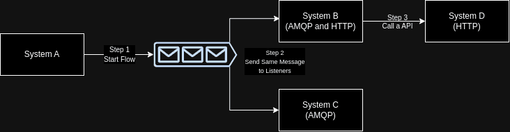
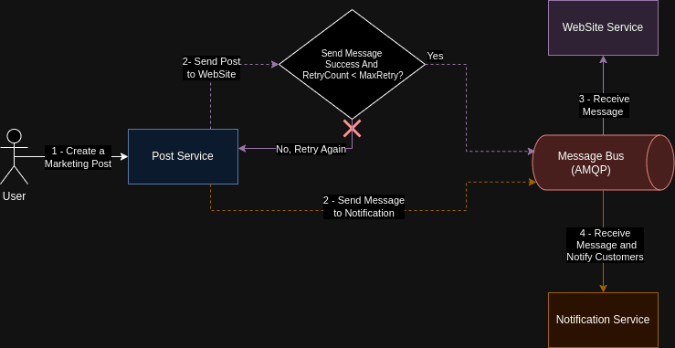

Neste artigo, demonstrarei como devemos lidar com cenários de transações ao usar Saga Pattern e realizar rollbacks destas entre microserviços de forma compilada juntamente com um exemplo abordando os principais tópicos desse padrão. O objetivo é usar esse artigo como consulta e revisão no futuro, aguardo seu feedback e boa leitura!

## A ideia da Saga

A ideia do uso de Sagas iniciou de um problema específico em sistemas que utilizam transações longas e/ou sequenciais (chamadas originalmente de [Long Lived Transactions](https://en.wikipedia.org/wiki/Long-lived_transaction) ou LLT) com operações envolvendo atomicidade em banco de dados e interação com outros sistemas. A forma mais comum da LLT é distribuir transações, ou seja, realizar operações em diversos serviços ou bases de dados que manipulam dados relacionados.

O padrão Saga amadureceu bastante com o tempo e hoje possui características auxiliares às arquiteturas modernas de sistemas distribuídos, base de dados como NoSQL e message brokers na qual devem lidar com a consistência dos dados e encontrar o equilíbrio seguindo o [Teorema CAP](https://pt.wikipedia.org/wiki/Teorema_CAP). Antes de apresentar esse pattern, vamos entender o problema das transações distribuídas!

## Problemas com Transações Distribuídas e ACID

Atualmente, encontramos arquiteturas de microserviços em sistemas modernos utilizando transações distribuídas seguindo o [modelo ACID.](https://www.lifewire.com/the-acid-model-1019731) Essa abordagem possui bastante limitações e pode acarretar problemas ao sincronizar dados e desfazer operações por conta de alguma indisponibilidade ou apenas por cancelamento de um processo.

O primeiro problema se torna aparente justamente na dependência de um microserviço realizar uma operação que necessita do inicio de outra operação em outro microserviço e o mande uma requisição. O segundo problema aparece numa das principais características do microserviço: arquitetura única, ou seja, são construídos seguindo padrões como o modelo de [database-per-microservice](https://microservices.io/patterns/data/database-per-service.html), onde tem-se a liberdade de selecionar o tipo do banco de dados e como persiste os dados, além de se comunicar de uma forma própria (via mensageria ou protocolo HTTP, por exemplo). Isso complica ainda mais na implementação do modelo ACID por conta do grande gerenciamento a cada transação realizada e, caso alguma falhe, avisa as demais que houve um problema e estas tomam providências.

Há outras maneiras de manter a consistência de dados com transações distribuídas além do Saga — já o apresento mais abaixo, prometo — como os protocolos *inter-process*, *two-phase commit*, *Try-Confirm-Cancel (TCC)*, entre outros. O foco desse artigo é o Saga por ser o mais utilizado e adequado a maioria das soluções e arquiteturas modernas de software.

## O Padrão Saga 

A saga é um fluxo representado com uma sequência de transações seguindo uma certa ordem de forma síncrona e/ou assíncrona. Essas transações não são distribuídas e, por isso, cada transação é local. Após confirmar o fim da transação, chama a próxima e assim sucessivamente até o fim da Saga. Podemos ter um identificador da saga para cada transação no encadeamento e obter um rastreamento do fluxo inteiro.

### Orquestração e Coreografia

A saga pode ser implementada seguindo dois modelos atuais:

Com um **Orquestrador**, também conhecido como **Saga Execution Coordinator (SEC)**, controlando cada transação da Saga e orientando qual será a próxima transação ou desfazer commits de transações passadas quando alguma transação ocorrer uma falha (falaremos disso a seguir). Assim como um maestro e sua orquestra, sabe sempre o próximo passo e quem deve realizá-lo.

Nesse exemplo simples, temos um Broker que gerencia, consolida e provê toda a comunicação entre os 3 serviços. A orquestração tem o lado ruim de depender do centralizador. Nesse caso, se o broker estiver fora do ar, todas os outros serviços e apps estarão também.

Ou seguindo o modelo de **Coreografia**, assim como em um Flash mob (eu devo estar velho!) cada integrante - ou um microserviço, no nosso caso - conhece como e quando deve realizar a sua parte aguardando ou não a vez de outro integrante. Voltando para nossa realidade, os microserviços conhecem a Saga e sabem aonde vão atuar e iniciar sua transação local.

No exemplo abaixo, temos um fluxo que envolve 4 sistemas (A, B, C e D) e possui 3 etapas a serem realizadas. Em cada etapa, os sistemas agem através de uma ação recebida, nesse caso usamos um broker de mensageria e chamada HTTP. A desvantagem disso, é a administração e monitoramento de cada sistema para garantir o funcionamento de ponta a ponta.

### Desafios ao implementar o padrão

Independente da abordagem implementada, e também em qualquer outro padrão e tecnologia , haverão obstáculos a serem considerados e entram na balança do [Trade-Off](https://pt.wikipedia.org/wiki/Trade-off).

Segue uma lista com alguns possíveis problemas:

- Implementação da observabilidade de forma mais detalhada para cada etapa do fluxo de uma Saga;
- Haverão pontos de falha. E entender como revertê-los em cada aplicação é essencial (detalho mais sobre com um exemplo a seguir);
- Debugar e rastrear uma entidade ou agregado pode ser mais difícil por conta de ter diversas na saga. Por isso um identificador da Saga e uma coordenação entre as aplicações durante todo o fluxo se faz necessário;
- Grande probabilidade do uso de Eventos (procure por Event-Driven Architecture) no fluxo da Saga, aumentando ainda mais a complexidade e obrigando a ter um maior controle do que é enviado e recebido em tópicos e filas;

## Exemplificando com Caso de uso 

Para exemplificar o uso da Saga, usamos um caso de uso ficticio envolvendo três microservicos em uma área de Marketing. Segue um resumo do uso de cada uma:

- O primeiro é um serviço de criação de Posts via API usadas por um funcionário de Marketing, o **Post Service**.
- O segundo é um serviço de envio de e-mail para clientes externos quando houver um novo Post e se comunica via mensageria, o **Notification Service**.
- O último é um serviço externo que recebe o post via mensageria e persiste em um banco de dados para um WebSite externo, o **WebSiteService.**

A Saga se inicia na criação de um Post de marketing (com promoções, cupons, etc) que deve ser notificado aos clientes e atualizado no site.

Abaixo, segue o fluxo de sucesso da Saga completa:

Tudo muito bonito! Maaas, e se, digamos, ao criar um novo Post, a notificação é feita aos clientes via e-mail mas não é atualizada no site. Temos uma falha crítica e devemos tratá-la, a seguir demonstro como lidarmos com esse problema.

## Lidando com falhas em uma Saga

### Padrão Retry (Retentativas)

Quando há uma falha, podemos seguir retentando um passo da Saga por uma certa quantidade de vezes combinada com um intervalo de tempo, até termos certeza da ocorrência da falha e ela não será resolvida automaticamente. Essa abordagem de retentar alguma ação chamamos de Retry Pattern.

No fluxo acima, imagine a situação em que a mensageria ficou offline por alguns segundos e a mensagem para o serviço do WebSite não foi enviada (passo 3). Assumindo que o Post Service possui uma política de retentativas das mensagens tentando por uma quantidade de vezes a cada x minutos, temos o seguindo fluxo:

Muito Bom né? o serviço realizou diversas tentativas até a mensageria estar no ar novamente e não precisamos ter um alerta gritando por aí. Mas…e quando temos certeza da falha, mesmo depois de aplicar todas as políticas de retentativa? Precisamos realizar alguma outra ação para resolver, ou até desfazer, a nossa Saga. A resposta pode estar nas transações compensatórias!

### Transações Compensatórias

Ok, houve uma falha no nosso fluxo impedindo a continução da Saga. Devemos compensar esse erro e desfazer as ações anteriores.

Para isso, o padrão Saga possui as Transações Compensatórias como um mecanismo indicador para que uma transação feita seja…desfeita além de avisar outras aplicações para desfazerem as suas transações localmente também. Com isso, seguimos com nosso caso de falha crítica onde clientes receberam as notificações de novas promoções e descontos mas não há nenhuma promoção no site!! Os próximos passos são desfazer e mandar uma errata para eles como uma compensação. Então, ajustamos o ponto no fluxo onde ocorre o erro e chegamos a uma resolução:

Os passos 3a e 3b fazem parte da transação compensatória assim que o passo 2 é realizado e há a falha.

### Diminuindo Rollbacks

Também podemos evitar que falhas e compensações aconteçam simplesmente analisando os pontos de falha e reorganizando o processo, também é possível revendo requisitos funcionais e não-funcionais.

Revendo todo o fluxo, evita-se a falha apresentada apenas ajustando o envio do Post a ser atualizado no site primeiro antes de enviar as notificações aos clientes. Ou seja, enviamos a mensagem ao WebSite Service (passo 3) depois de obter uma resposta indicando que a mensagem chegou com sucesso (passos 4a e 4b) e em seguida enviamos a mensagem de notificação aos clientes (passo 5). Isso evita o transtorno tratado anteriormente e também deixa o sistema mais resiliente e rastreável a falhas!

Por fim, segue o fluxo refatorado:

### Isso é tudo pessoal…

Nesse artigo vimos detalhes do Saga que não são encontrados tão facilmente juntamente com problemas que aparecem ao implementá-lo. Esse padrão é comumente utilizado com diversos padrões como [CQRS](https://martinfowler.com/bliki/CQRS.html) e [Event-Driven](https://learn.microsoft.com/en-us/azure/architecture/guide/architecture-styles/event-driven), agregando a arquitetura do sistema e fortificando sua estrutura em diversas aplicações e produtos.

Espero que tenha aumentado mais o seu conhecimento e leque de técnicas aplicadas a engenharia e arquitetura de software! Até a próxima o/

## Referências e Links úteis

- Exemplo de Uso da Saga com Kafka e .Net: https://github.com/luanmds/kafka-dotnet-study/tree/main/sample-02
- [https://learn.microsoft.com/en-us/azure/architecture/reference-architectures/saga/saga](https://learn.microsoft.com/en-us/azure/architecture/reference-architectures/saga/saga)
- [https://medium.com/codex/compensating-transaction-in-microservices-15b1f88a7c29](https://medium.com/codex/compensating-transaction-in-microservices-15b1f88a7c29)
- [https://livebook.manning.com/book/microservices-patterns/chapter-4/](https://livebook.manning.com/book/microservices-patterns/chapter-4/)
- [https://blog.sofwancoder.com/try-confirm-cancel-tcc-protocol](https://blog.sofwancoder.com/try-confirm-cancel-tcc-protocol)
- [https://en.wikipedia.org/wiki/Inter-process_communication](https://en.wikipedia.org/wiki/Inter-process_communication)
- [https://en.wikipedia.org/wiki/Two-phase_commit_protocol](https://en.wikipedia.org/wiki/Two-phase_commit_protocol)
- https://www.cs.cornell.edu/andru/cs711/2002fa/reading/sagas.pdf
- [https://en.wikipedia.org/wiki/Long-lived_transaction](https://en.wikipedia.org/wiki/Long-lived_transaction)
- https://www.lifewire.com/the-acid-model-1019731
