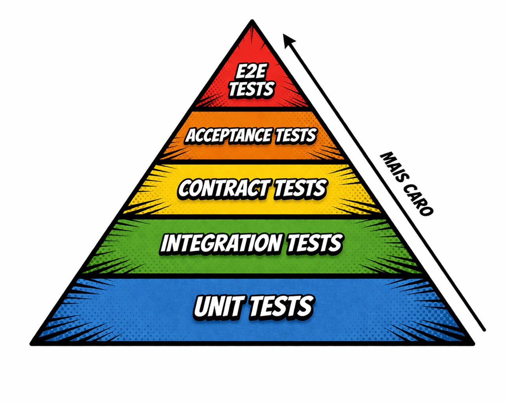

Nesse artigo vamos abordar de forma compilada os conceitos, definições e boas práticas gerais em Testes de Integração. No detalhe, entenderemos em quais cenários os testes de integração se encaixam, como implementar de forma fácil de manter, além de ver quando não usar mocks em seus cenários. **Compreender isso lhe capacita a tomar decisões relacionadas a testes automatizados e a medir o esforço necessário antes mesmo de implementar, usando qualquer linguagem de programação ou framework**.

**Hands-on:** Para consolidar esses estudos, desenvolvi o repositório [**tests-dotnet-best-practices**](https://github.com/luanmds/tests-dotnet-best-practices). Lá, você encontrará alguns exemplos de implementação prática incluindo todos os conceitos que discutiremos neste artigo!

Boa leitura!

## Pirâmide de testes e onde a integração entra

A famosa pirâmide de testes ordena os tipos de testes que um software pode realizar, sempre do mais barato (o Unit Tests na base) para o mais caro (E2E no topo). Os testes de integração estão ali no meio, acima dos testes de unidade, lidando com 20% a 30% da suíte de testes.

Os **testes de integração** ocupam uma camada intermediária, sendo responsáveis por verificar a conexão, interação e os contratos entre componentes, módulos ou serviços. Além de expor problemas a nível de sistema e garantir uma alta cobertura servindo de um feedback importante antes de cada deploy.

Vale comentar que **os testes de integração não garantem 100% de cobertura** e deve ser utilizado em conjunto com outros testes - como o de unidade, mas remove aquela “*pulga atrás da orelha”* respondendo perguntas como: *“Se eu atualizar esse módulo, vai quebrar nos módulos dependentes?”* ou *“Como eu garanto que esse fluxo continue funcionando quando o componente X não estiver disponível?”*.

## Abordagens para testar integrações

Para escolher uma abordagem é necessário entender como estão acoplados os componentes da aplicação e qual o nível de complexidade para isolar falhas dos fluxos que os envolvem.

*Dica: Comece com fluxos críticos onde deve-se garantir que funcionarão em diversas situações e cenários.*

Os tipos de abordagens são:

- **Big Bang:** Todos os módulos são integrados simultaneamente e testados como um todo. Embora pareça rápido, é a abordagem mais arriscada, pois torna a depuração extremamente difícil quando um erro ocorre, já que a falha pode estar em qualquer lugar da cadeia. 
- **Incremental:** Abordagens focadas em testar um conjunto de módulos da aplicação. Seguem elas: - **Top-Down:** O teste começa pelas camadas superiores (como Controllers ou APIs) e desce em direção às camadas de infraestrutura. Utiliza-se *Stubs* para substituir os módulos inferiores que ainda não foram integrados. - **Bottom-Up:** Inicia-se pelos módulos de baixo nível (como Repositórios e Drivers de banco de dados) e sobe para as camadas de lógica de negócio. É excelente para validar a persistência de dados logo no início do desenvolvimento. - **Sanduíche (Híbrida):** Combina as vantagens das abordagens *Top-Down* e *Bottom-Up*, testando o núcleo do sistema enquanto as camadas periféricas são integradas gradualmente.

### Escopo de Teste

Para uma visão mais moderna e aplicada a microsserviços e sistemas distribuídos, é fundamental diferenciar o alcance do teste:

- **Narrow Integration Tests (Estreitos):** Focam apenas na comunicação entre o serviço e um componente externo específico (ex: um repositório e o SQL Server). O restante do sistema é substituído por dublês de teste (*test doubles*). São mais rápidos e fáceis de manter.
- **Broad Integration Tests (Amplos):** Validam a integração de todos os componentes vivos que compõem uma funcionalidade, cruzando diversas camadas e serviços. Eles exigem um ambiente mais complexo, mas garantem que o fluxo completo de ponta a ponta esteja íntegro.

## Cenários ideais para o uso

Nem toda funcionalidade exige um teste de integração. O valor desses testes reside na validação de fluxos que cruzam as fronteiras da aplicação. Os cenários onde eles são indispensáveis incluem:

### 1. Comunicação com Infraestrutura de Persistência e Cache

Cenários onde a aplicação interage com bancos de dados (SQL ou NoSQL) e sistemas de cache (como Redis). Garantindo que as *queries*, mapeamentos de ORM (como Entity Framework), migrações e restrições de integridade (chaves estrangeiras, índices) funcionem conforme o esperado no motor de banco de dados real.

### 2. Integração com Serviços de Mensageria

Cenários que envolvem a publicação e o consumo de eventos em *Message Brokers* (RabbitMQ, Azure Service Bus, Kafka). Validando se a serialização dos objetos está correta, se as filas/tópicos estão configurados adequadamente e se a aplicação reage corretamente a falhas de conexão ou retentativas.

### 3. Consumo de APIs Externas e Web Services

Quando o sistema depende de APIs de terceiros (Gateways de pagamento, serviços de CEP, etc.). Permitindo validar se o contrato da API externa ainda é respeitado e como o seu sistema lida com diferentes códigos de status HTTP (400, 401, 500) e *timeouts*. Aqui também pode conter alguns testes de contrato.

### 4. Fluxos de Negócio Críticos 

Processos *core* que não podem deixar de funcionar e atravessam diversos serviços ou domínios dentro da mesma aplicação. Por exemplo, um processo de *checkout* que envolve componentes relacionados a: estoque, pagamento e logística. Nesses fluxos, os testes de unidade costumam "mockar" as dependências, o que pode esconder bugs de lógica que surgem apenas no encadeamento real das chamadas.

## Boas práticas para seguir

Implementar testes de integração exige mais do que apenas código; exige uma estratégia de ambiente e uma compreensão clara de onde o risco reside. A seguir, deixo boas práticas, quase obrigatórias (para mim são sempre obrigatórias rs) para garantir uma melhor implementação e manutenção dos testes:

### Identificando componentes e o SUT

Antes de tocar no teclado, o passo fundamental é mapear e diagramar todos os componentes do sistema. Incluindo o **SUT (System Under Test)**. No contexto de integração, o SUT geralmente é a sua API ou um serviço específico que precisa interagir com o "mundo externo". Com isso, você terá uma visão ampla das **fronteiras de infraestrutura** e dependências externas.

**Foque onde o código realiza operações de entrada e saída (E/S)**, como bancos de dados, APIs de terceiros, microserviços e filas de mensagens. Também olhe em fluxos com componentes que possuem um alto acoplamento, esses são os mais frágeis com toda certeza! Se sua arquitetura utiliza padrões como *Adapters* ou Camadas de Repositório, estes são os alvos primários para garantir que a tradução de dados entre o seu domínio e o mundo externo esteja correta.

As técnicas [*BDD (Behaviour-Driven Design)*](https://behave.readthedocs.io/en/latest/philosophy/) e [*Event Storming*](https://www.eventstorming.com/), ajudam a mapear com facilidade. E para identificar o nível de acoplamento de cada componente, podemos utilizar as denotações de [Acoplamento Aferente e Eferente](https://coupling.dev/posts/related-topics/afferent-and-efferent-coupling/).

### Criando um ambiente mais próximo de Produção

A utilidade de um teste de integração está diretamente ligada à sua fidelidade. A melhor prática moderna é o uso de **containerização** (via Docker) para simular a infraestrutura real. Isso permite que você execute os testes contra motores de banco de dados e brokers de mensageria idênticos aos de produção, aumentando drasticamente a chance de encontrar erros reais de configuração ou comportamento.

Além disso, integre esse ambiente à sua **pipeline de CI**. Embora nem toda mudança exija a execução completa da suíte — especialmente se não houver alteração em módulos de integração — ter essa rede de segurança automatizada é o que impede regressões no ambiente final.

### Test Doubles e por que não usar em fluxos críticos

Os dublês de teste (*Test Doubles*) são ferramentas poderosas para isolamento e performance. Eles são ideais em **cenários de dependências lentas, inacessíveis ou quando você precisa simular falhas difíceis de reproduzir** (como *timeouts* de rede).

- **Mocks:** Para validar comportamentos e interações.
- **Stubs:** Para fornecer respostas prontas e simples.
- **Fakes:** Para implementações funcionais, porém simplificadas (como um SQLite em memória).

Contudo, existe uma armadilha: **evite dublês em fluxos críticos**. Um banco de dados "fake" pode ter comportamentos de sensibilidade a maiúsculas ou transações complexas diferentes do seu banco real, o que pode mascarar bugs fatais. Para o núcleo do seu negócio, a validação de alta fidelidade contra recursos reais é inegociável para garantir um deploy seguro

### Teste de Contrato através da integração

Em ecossistemas distribuídos e arquiteturas de microsserviços, garantir que quem consome e quem provê a informação falem exatamente a mesma língua é vital. O **Teste de Contrato** surge para resolver o problema dos testes de integração que se tornam lentos ou instáveis demais por dependerem de muitos serviços ativos simultaneamente.

Esse teste foca na estrutura das mensagens e protocolos de comunicação, sendo mais leve e rápido por não exigir todo o ecossistema ativo, **podendo ser executado como um teste à parte dentro da sua estratégia de integração**, utilizando ferramentas como o [**Pact**](https://devblogs.microsoft.com/ise/pact-contract-testing-because-not-everything-needs-full-integration-tests/) para validar a compatibilidade entre APIs e mensageria de forma eficiente.

## Isso é tudo pessoal…

Se chegou até aqui, você percebeu que escrever testes de integração não é apenas sobre aumentar o percentual de cobertura de código. Ao entender as fronteiras da sua aplicação, escolher a abordagem correta para cada escopo e aplicar ferramentas modernas para simular o mundo real (como contêineres reais em vez de apenas *mocks*), você eleva drasticamente a resiliência do seu sistema.

A teoria é o mapa, mas a prática é o caminho. Não deixe de conferir o repositório [**tests-dotnet-best-practices**](https://github.com/luanmds/tests-dotnet-best-practices) para ver como aplicar esses conceitos no código real usando .NET 9, Testcontainers, Aspire e outras coisitas mais!

Se este conteúdo foi útil para você, me mande um feedback e compartilhe com seu time.Aliás, aqui vai uma pergunta: quais são os seus maiores desafios ao criar testes de integração nos seus projetos? Deixe nos comentários, vamos trocar experiências!

## Referências

- [https://martinfowler.com/bliki/IntegrationTest.html](https://martinfowler.com/bliki/IntegrationTest.html)
- [Integration Testing - Engineering Fundamentals Playbook](https://microsoft.github.io/code-with-engineering-playbook/automated-testing/integration-testing/)
- [Integration Testing - Software Engineering - GeeksforGeeks](https://www.geeksforgeeks.org/software-testing/software-engineering-integration-testing/)
- [ASP.NET Core Integration Testing Tutorial](https://www.youtube.com/watch?v=RXSPCIrrjHc&pp=ygUSaW50ZWdyYXRpb24gdGVzdHMg)
- [https://learn.microsoft.com/en-us/aspnet/core/test/integration-tests](https://learn.microsoft.com/en-us/aspnet/core/test/integration-tests?view=aspnetcore-9.0&pivots=nunit)
- [Choosing a testing strategy - EF Core \| Microsoft Learn](https://learn.microsoft.com/en-us/ef/core/testing/choosing-a-testing-strategy)
- [https://coupling.dev/posts/related-topics/afferent-and-efferent-coupling/](https://coupling.dev/posts/related-topics/afferent-and-efferent-coupling/)
- [https://behave.readthedocs.io/en/latest/philosophy/](https://behave.readthedocs.io/en/latest/philosophy/)
