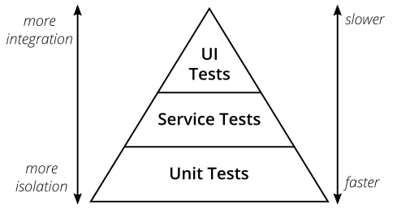
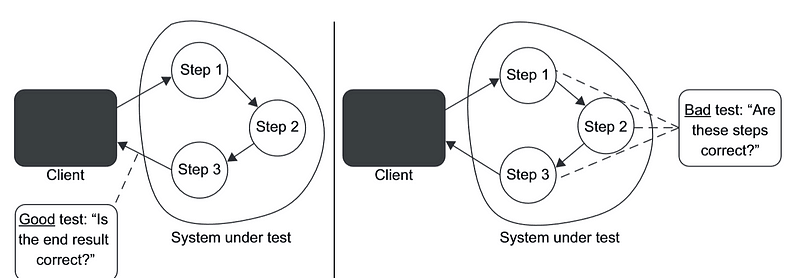
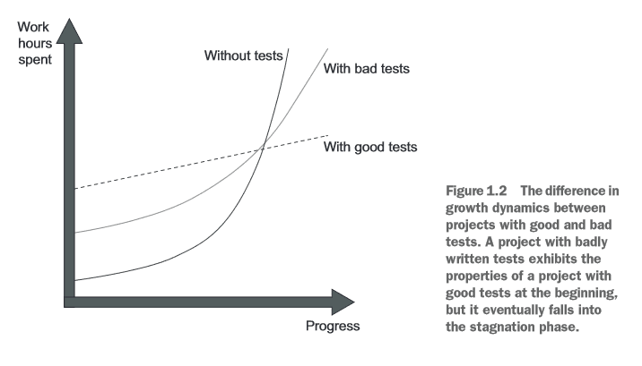

Essa é a **parte um do artigo sobre Boas práticas em Unit Tests com .Net** contendo os fundamentos e a base de estudo com o intuito de entender o que é um teste de unidade, saber diferenciar o teste bom do teste ruim e como é a anatomia do teste bom.

*Caso já tenha lido este artigo, siga para a* *[Segunda Parte com a prática](https://medium.com/@luan.dev.mello/boas-pr%C3%A1ticas-em-unit-tests-com-net-a-pr%C3%A1tica-ed1eebc0cfb3).*

### Unit test, o teste do Dev

Teste de unidade ou teste unitário é uma categorização da pirâmide de testes automatizados (criada por Mike Cohn). Pode-se considerá-lo como o mais importante, pois é a base dessa pirâmide.

Por ser a primeira camada da pirâmide, é o teste mais próximo do código, e é esperado que seja o **mais isolado e de execução rápida quanto possível**. Se tornando uma **responsabilidade do próprio Desenvolvedor.**



Como seu próprio nome diz, foca em realizar testes de forma unitária com uma granularidade própria e isolando os comportamentos de uma aplicação ou sistema.

Antes de continuar apresento duas siglas importantes nos testes unitários: SUT e MUT.

**SUT ou System Under Test** é o QUEM estamos testando do sistema. Podendo ser qualquer parte dele, como uma classe ou um conjunto de classes que geram um comportamento.

**MUT ou Method Under Teste** é o QUE estamos testando do sistema. Representa o comportamento do SUT que queremos testar nossos cenários.

### Testes Ruins

Para classificarmos um teste de unidade como ruim veja o exemplo abaixo:

```csharp
[Fact]
public void test_when_data_null()
{
var x = new Customer() {Document = null};
Assert.False(x.IsValidDocument(),"Document is not valid");
}
```

Nesse exemplo, nota-se que aparentemente é um teste simples e curto mas precisamos até ler duas vezes para entender melhor, ou por vezes, nem conseguimos entender.

Podemos ver que o nome do método **test_when_data_null** é confuso, não tendo nenhuma coesão com o que está sendo testado, além disso não se sabe ao certo para que serve o teste e como está sendo testado, sendo perigoso alterar algo e quebrá-lo!

Com isso chegamos as principais características de um teste unitário ruim:

- O alto custo de manutenabilidade. Já que custa tempo e esforço do profissional para codar e entender o que está feito;
- Gerar falsos alarmes. Ou seja, este quebrar sem mudança significativa no código;
- Dificuldade em refatoração. Com o mesmo efeito do anterior mas podendo ser difícil alterar a si mesmo;
- Inelegibilidade do código;

### Testes Bons

Um bom teste de unidade segue esses três princípios básicos:

- Verifica o comportamento do sistema, ou seja, uma unidade;
- Executa rapidamente, mas vai do tempo satisfatório para o desenvolvedor;
- E é executado de maneira isolada, de forma a não afetar outros testes unitários;

Veja o código a seguir:

```csharp
[Fact]
public async void CreateScore_successfully_when_customer_exists()
{
var customer = _fixture.Create<Customer>();
_customerRepositoryMock.Setup(x => x.GetAsync(customer.Id))
.ReturnsAsync(customer);
await _service.CreateScore(customer.Id);
_customerRepositoryMock.Verify(x => x.GetAsync(customer.Id),
Times.Once);
_repositoryMock.Verify(x => x.SaveAsync(It.IsAny<Score>()),
Times.Once);
}
```

Esse é um bom exemplo pois segue os princípios acima e cobre os problemas apresentados no teste ruim. Nele, é possível entender o objetivo do teste, as regras que estão sendo testadas e as asserções que precisam ser validadas.

Além disso, tem-se vantagens adicionais como:

#### Proteção contra regressões no sistema

Com o teste focado apenas no necessário, priorizando o domínio e os comportamentos mais críticos do sistema, evita-se regressões no código assim que os testes unitários forem executados, antes do deploy da aplicação.

Para evitar regressões é preciso evitar testes em *Libraries*, *Frameworks* e sistemas externos, esse último se encaixa como um teste de integração.

> A dica é colocar esses recursos como apenas dependências dos testes unitários.

#### Feedback rápido de seu status

Testes focados apenas no necessário, simulando o comportamento esperado e alcançando seu resultado, conseguem executar de forma mais rápida e responder se houve sucesso ou falha.

#### Resistência na Refatoração

Esse tipo de teste deve evitar ao máximo uma refatoração em si causada por uma refatoração ou mudança no código do domínio.

Refatoração que quebra um teste unitário pode demonstrar um falso positivo — teste falha mas continua cobrindo o comportamento e seu resultado. Isso vai do desenvolvedor entender melhor o que está sendo testado!

Fonte: Unit Testing
Principles, Practices, and Patterns de Vladimir Khorikov

> Dica: Foque os testes nos resultados gerados em chamadas do método
> (MUT) no SUT e não em cada passo realizado de forma interna para gerar o resultado.

### A Entropia dos testes

A medida que adicionamos novos recursos no código-base, acrescentamos complexidade e até desorganização nele.

Em outras palavras, ele se deteriora com o tempo e acontece um efeito chamado **Entropia** (assim como na [termodinâmica](https://pt.wikipedia.org/wiki/Termodin%C3%A2mica)). **Mas testes de unidade sendo bem escritos e uma refatoração constante no código de produção auxiliam na diminuição do efeito.**

Fonte: Unit Testing
Principles, Practices, and Patterns de Vladimir Khorikov

### A forma do teste de unidade bom

O teste de unidade bom segue padrões que o torna sólido, legível, organizado e dinâmico. A seguir demonstra-se os mais utilizados:

#### Padrão AAA — Arrange, Act and Assert

Esse padrão é utilizado para organizar qual comportamento será testado, suas dependências e como é validado o resultado.

- **Arrange** é a primeira etapa e consiste em organizar seus objetos, criá-los e alimentá-los com valores iniciais — ou o que for mais necessário — para que o teste funcione;
- **Act** é, literalmente, a ação ou execução do objeto para obter um valor a ser testado. Evite utilizar mais de uma ação ou ato no teste;
- **Assert** a última etapa, responsável por realizar o teste de unidade em si e retornar um resultado deste;
- O **Given_When_Then** também ajuda a entender o fluxo do teste de uma outra maneira mas que alcance o mesmo resultado;

> Dica: Evite utilizar condicionais **IF** dentro do código do teste.
> Além de não alcançar os princípios anteriormente ditos, demonstra que
> o teste está realizando alguma ação a mais que não seja necesssária.

#### Nomenclatura de um unit test

Um bom padrão que auxilia na nomenclatura é:

\[MethodUnderTest\]\_\[Scenario\]\_\[ExpectedResult\]

- **MethodUnderTest**: O nome do método que está sendo testado.
- **Scenario**: O cenário em que ele está sendo testado.
- **ExpectedResult**: O comportamento esperado quando o cenário é invocado.
- **Exemplo**: Sum_WithTwoValidNumbers_ReturnsSum ou Sum_With_Two_ValidNumbers_ReturnsSum

> Dica: Não é necessário seguir a risca esse padrão pois o que se espera
> é algo legível e que fique de forma clara o objetivo do teste para o
> desenvolvedor. Um bom exemplo é: Sum_of_two_numbers

#### Reuso de código entre testes

Quando um conjunto de testes utiliza dependências ou inicia instâncias de forma idêntica na etapa do Arrange — chamamos de Test Fixtures — já pode se pensar em reutilizar o código, abstraindo-o com alguns padrões.

#### Usando método privado

Já deve reduzir bastante a quantidade de código e reaproveitar instanciações de uma mesma classe e um conjunto de testes unitários comum.

Nesse cria-se um método privado na própria classe/arquivo dos testes de unidade que inicializa e dispõe de objetos comuns. Segue o exemplo:

```csharp
public class CustomerTests{
[Fact]
public void Purchase_succeeds_when_enough_inventory()
{
Store store = CreateStoreWithInventory(Product.Shampoo, 10);
Customer sut = CreateCustomer(); // generate a no-data Customer
bool success = sut.Purchase(store, Product.Shampoo, 5);
Assert.True(success);
Assert.Equal(5, store.GetInventory(Product.Shampoo));
}
[Fact]
public void Purchase_fails_when_not_enough_inventory()
{
Store store = CreateStoreWithInventory(Product.Shampoo, 10);
Customer sut = CreateCustomer(); // generate a no-data Customer
bool success = sut.Purchase(store, Product.Shampoo, 15);
Assert.False(success);
Assert.Equal(10, store.GetInventory(Product.Shampoo));
}
private Store CreateStoreWithInventory(Product product, int quantity)
{
Store store = new Store();
store.AddInventory(product, quantity);
return store;
}
private static Customer CreateCustomer()
{
return new Customer();
}
}
```

#### Teste Data Builder

Técnica que utiliza-se do padrão Builder para gerar e montar um objeto útil no teste.

Continuando nosso exemplo anterior, podemos ter uma classe auxiliar para criar um Customer:

```csharp
public class CustomerBuilderStub {
private Long CustomerId;
private string Document;
private int Age;
private Coupon Coupon;
public CustomerBuilderStub withId(Long customerId) {
this.CustomerId = customerId;
return this;
}
public CustomerBuilderStub withDocument(string document) {
this.Document = document;
return this;
}
public CustomerBuilderStub withAge (int age) {
this.Age = age;
return this;
}
public CustomerBuilderStub withCouponCode(Coupon coupon) {
this.Coupon = coupon;
return this;
}
public Customer build() {
Customer customer = new Customer(CustomerId, Document, Age, Coupon);
return customer;
}
}
```

### Mocks e Stubs, os ajudantes do teste unitário

Grande parte das vezes quando se está codificando um teste de unidade, é necessário criar uma falsificação de uma dependência do SUT que estamos testando pois é importante que a dependência responda de uma maneira esperada para o próprio teste.

De forma geral, chamamos essa “falsificação” de *Test Double*, ou dublê de testes. Há basicamente 2 grandes grupos de Test Double são eles: **Mocks e Stubs.**

#### Mocks

São objetos configurados para atender expectativas que formam chamadas específicas com o objetivo de auxiliar nas interações futuras que alteram o estado do SUT.

#### Stubs

Objetos que fornecem respostas enlatadas para chamadas feitas durante o teste, geralmente não respondendo a nada fora do que está programado para o teste. Focam em auxiliar nas interações recebidas quando o SUT chama suas dependências e obtem dados de entrada (input). Exemplos clássicos são: Banco de Dados, criação complexa do objeto de uma dependência, algum Service, etc.

#### Mocks podem ser Stubs

Um Mock pode agir como um Stub onde ele é usado para alterar o estado de um SUT e no mesmo teste tem papel de ser um gerador de dado de entrada para auxiliar um método dentro do próprio SUT.

```csharp
[Fact]
public void Purchase_fails_when_not_enough_inventory()
{
var storeMock = new Mock<IStore>();
// configura uma resposta fechada
storeMock.Setup(x => x.HasEnoughInventory(Product.Shampoo,
5).Returns(false);
var sut = new Customer();
bool success = sut.Purchase(storeMock.Object, Product.Shampoo, 5);
Assert.False(success);
// verifica a chamada de um SUT
storeMock.Verify(x => x.RemoveInventory(Product.Shampoo, 5),
Times.Never);
}
```

### Referências

- [Melhores práticas para escrever testes de unidade — .NET](https://learn.microsoft.com/pt-br/dotnet/core/testing/unit-testing-best-practices)
- [Unit Testing Principles, Practices, and Patterns — Vladimir Khorikov](https://www.amazon.com/Unit-Testing-Principles-Practices-Patterns/dp/1617296279)
- [Código C# de teste de unidade no .NET Core usando dotnet test e xUnit — .NET](https://learn.microsoft.com/pt-br/dotnet/core/testing/unit-testing-with-dotnet-test)
- [Test Data Builders: você está usando corretamente?](https://robsoncastilho.com.br/2020/03/27/test-data-builders-voce-esta-usando-corretamente/)
- [How to Create a Test Data Builder \| Code With Arho](https://www.arhohuttunen.com/test-data-builders/)
- [Mocks Aren’t Stubs](https://martinfowler.com/articles/mocksArentStubs.html#TestsWithMockObjects)
